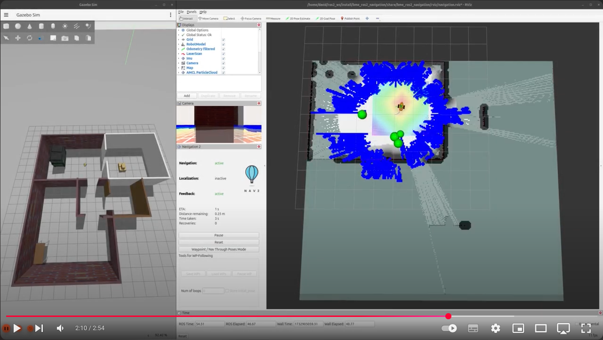
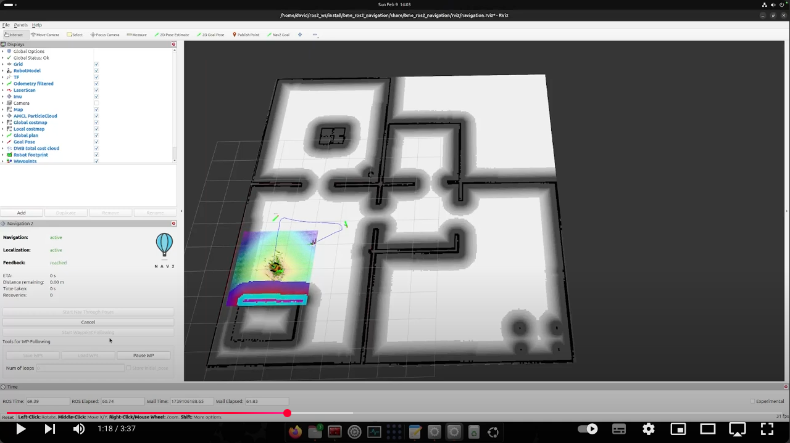
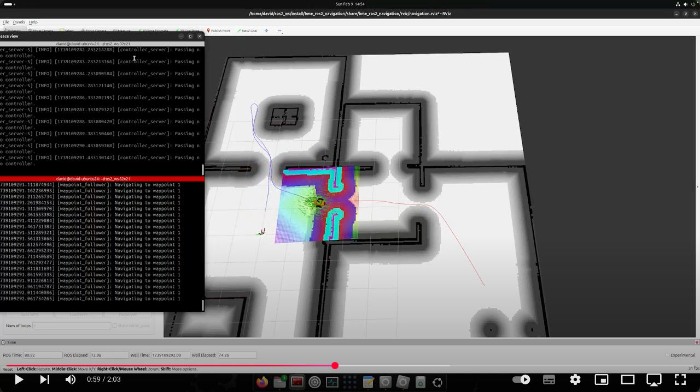
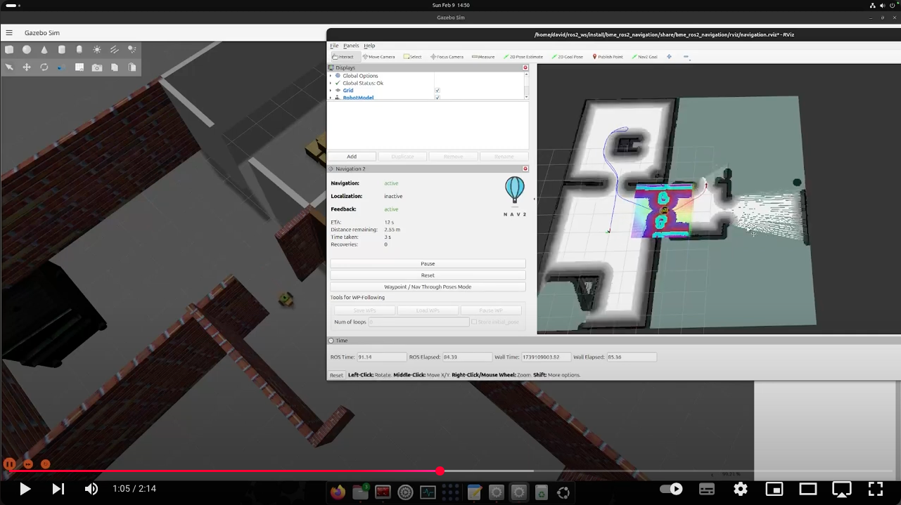
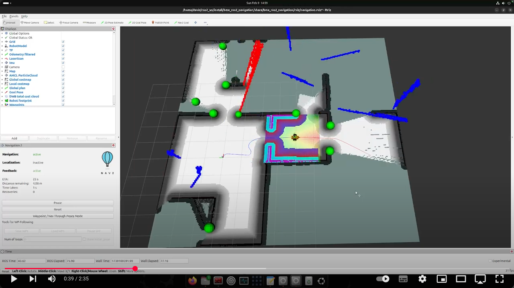

[//]: # (Image References)

[image1]: ./assets/starter-package.png "Starter package"
[image2]: ./assets/rqt-graph.png "rqt_graph"
[image3]: ./assets/tf-tree.png "rqt_tf_tree"
[image4]: ./assets/tf-tree-1.png "rqt_tf_tree"
[image5]: ./assets/mapping.png "mapping"
[image6]: ./assets/save-map.png "Save map"
[image7]: ./assets/load-map.png "Load map"
[image8]: ./assets/load-map-1.png "Load map"
[image9]: ./assets/localization.png "Localization"
[image10]: ./assets/localization-1.png "Localization"
[image11]: ./assets/localization-2.png "Localization"
[image12]: ./assets/localization-3.png "Localization"
[image13]: ./assets/localization-4.png "Localization"
[image14]: ./assets/navigation.png "Navigation"
[image15]: ./assets/navigation-1.png "Navigation"
[image16]: ./assets/navigation-2.png "Navigation"
[image17]: ./assets/waypoint.png "Waypoint navigation"
[image18]: ./assets/waypoint-1.png "Waypoint navigation"
[image19]: ./assets/waypoint-2.png "Waypoint navigation"
[image20]: ./assets/waypoint-3.png "Waypoint navigation"
[image21]: ./assets/waypoint-4.png "Waypoint navigation"
[image22]: ./assets/navigation-slam.png "Navigation with SLAM"
[image23]: ./assets/exploration.png "Exploration"
[image24]: ./assets/rqt-graph-1.png "rqt_graph"

# Week 7-8: Navigation

## This is how far we will get by the end of this lesson: 
  <a href="https://youtu.be/NkOX4zX9XbQ"></a>  


# Table of Contents
1. [Introduction](#introduction)  
1.1. [Download ROS package](#download-ros-package)  
1.2. [Test the starter package](#test-the-starter-package)  
2. [Mapping](#mapping)  
2.1. [SLAM toolbox](#slam-toolbox)  
3. [Localization](#localization)  
3.1. [Localization with AMCL](#localization-with-amcl)  
3.2. [Localization with SLAM toolbox](#localization-with-slam-toolbox)  
4. [Navigation](#navigation)  
4.1. [Waypoint navigation](#waypoint-navigation)  
4.2. [Navigation with SLAM](#navigation-with-slam)  
5. [Exploration](#exploration)  

# Introduction

In this lesson we'll lear how to map the robot's environment, how to do localization on an existing map and we'll learn to use ROS2's navigation stack.

## Download ROS package

To download the starter package, clone the following git repo with the `starter-branch` (using the `-b branch` flag) into your colcon workspace:
```bash
git clone -b starter-branch https://github.com/MOGI-ROS/Week-7-8-ROS2-Navigation
```

Let's take a look what's inside the `bme_ros2_navigation` package with the `tree` command!


```bash
.
├── CMakeLists.txt
├── package.xml
├── config
│   ├── amcl_localization.yaml
│   ├── ekf.yaml
│   ├── gz_bridge.yaml
│   ├── navigation.yaml
│   ├── slam_toolbox_localization.yaml
│   ├── slam_toolbox_mapping.yaml
│   └── waypoints.yaml
├── launch
│   ├── check_urdf.launch.py
│   ├── spawn_robot.launch.py
│   └── world.launch.py
├── maps
│   ├── my_map.pgm
│   ├── my_map.yaml
│   ├── serialized.data
│   └── serialized.posegraph
├── meshes
│   ├── lidar.dae
│   ├── mogi_bot.dae
│   └── wheel.dae
├── rviz
│   ├── localization.rviz
│   ├── mapping.rviz
│   ├── navigation.rviz
│   ├── rviz.rviz
│   └── urdf.rviz
├── urdf
│   ├── materials.xacro
│   ├── mogi_bot.gazebo
│   └── mogi_bot.urdf
└── worlds
    ├── empty.sdf
    └── home.sdf
```

Let's see what will we do with the existing files and folders:
- `config`: As we saw previously, we usually store parameters and large configuration files for ROS packages which aren't comfortable to handle from the launchfiles directly. In this lesson we will use more configuration files from this folder.
- `launch`: Default launch files are already part of the starting package, we can test the package with `spawn_robot.launch.py`.
- `maps`: Offline map files for the Gazebo world
- `meshes`: this folder contains the 3D models in `dae` format (collada mesh) that we use for our robot's body, wheels and lidar sensor.
- `rviz`: Pre-configured RViz2 layouts
- `urdf`: The URDF models of our robot, we'll extend the `mogi_bot.urdf` and `gazebo` files through this lesson
- `worlds`: default Gazebo worlds that we'll use in the simulations.

We have another package `bme_ros2_navigation_py` for our python scripts:
```bash
.
├── bme_ros2_navigation_py
│   ├── __init__.py
│   ├── send_initialpose.py
│   └── slam_toolbox_load_map.py
├── package.xml
├── resource
│   └── bme_ros2_navigation_py
├── setup.cfg
└── setup.py
```

## Test the starter package

After we downloaded the `starter-branch` from GitHub, let's rebuild the workspace and source the `install/setup.bash` file to make sure ROS and its tools are aware about the new package. Before we test it let's take a look on the `spawn_robot.launch.py`, we'll notice a few important changes!
- This package uses ekf sensor fusion by default, we don't forward the `tf` transformations from Gazebo, because it's done by the `robot_localization` package.
- We moved all the `parameter_bridge` topics into a yaml config file `gz_bridge.yaml`, we don't describe them in the launch file anymore, this is more comfortable when we forward many topics.
- There is a new node in the launch file `marker_server` from the `interactive-marker-twist-server` this can be used to move and rotate our robot directly from RViz. Let's install it with `sudo apt install ros-jazzy-interactive-marker-twist-server`!

Now we are ready to test the package with the usual launch file:
```bash
ros2 launch bme_ros2_navigation spawn_robot.launch.py
```

![alt text][image1]

Let's see the `rqt_graph` tool to see the connections between the nodes:
![alt text][image2]

And also try the `rqt_tf_tree`:

```bash
ros2 run rqt_tf_tree rqt_tf_tree
```

![alt text][image3]

# Mapping

Let's learn how to create the map of the robot's surrounding. In practice we are using SLAM algorithms, SLAM stands for Simultaneous Localization and Mapping. It is a fundamental technique in robotics (and other fields) that allows a robot to:
1.	Build a map of an unknown environment (mapping).
2.	Track its own pose (position and orientation) within that map at the same time (localization).

Usually SLAM algorithms consists of 4 core functionalities:
1.	Sensor inputs  
SLAM typically uses sensor data (e.g., LIDAR scans, camera images, or depth sensor measurements) to detect features or landmarks in the environment.
2.	State estimation  
An internal state (the robot’s pose, including x, y, yaw) is estimated using algorithms like Extended Kalman Filters, Particle Filters, or Graph Optimization.
3.	Map building  
As the robot moves, it accumulates new sensor data. The SLAM algorithm integrates that data into a global map (2D grid map, 3D point cloud, or other representations).
4.	Loop closure  
When the robot revisits a previously mapped area, the SLAM algorithm detects that it’s the same place (loop closure). This knowledge is used to reduce accumulated drift and refine both the map and pose estimates.

## SLAM Toolbox

In this lesson we will use the `slam_toolbox` package that has to be installed first:

```bash
sudo apt install ros-jazzy-slam-toolbox
```

After installing it we will create a new launch file for mapping, the `slam_toolbox` parameters are already in the `config` folder (`slam_toolbox_mapping.yaml`) we'll use these parameters. Let's also move the `interactive_twist_marker` and RViz related functions into the new launch file from `spawn_robot.launch.py`.

```python
    #launchDescriptionObject.add_action(rviz_launch_arg)
    #launchDescriptionObject.add_action(rviz_config_arg)
    launchDescriptionObject.add_action(world_arg)
    launchDescriptionObject.add_action(model_arg)
    launchDescriptionObject.add_action(x_arg)
    launchDescriptionObject.add_action(y_arg)
    launchDescriptionObject.add_action(yaw_arg)
    launchDescriptionObject.add_action(sim_time_arg)
    launchDescriptionObject.add_action(world_launch)
    #launchDescriptionObject.add_action(rviz_node)
    launchDescriptionObject.add_action(spawn_urdf_node)
    launchDescriptionObject.add_action(gz_bridge_node)
    launchDescriptionObject.add_action(gz_image_bridge_node)
    launchDescriptionObject.add_action(relay_camera_info_node)
    launchDescriptionObject.add_action(robot_state_publisher_node)
    launchDescriptionObject.add_action(trajectory_node)
    launchDescriptionObject.add_action(ekf_node)
    #launchDescriptionObject.add_action(interactive_marker_twist_server_node)
```

Also change the `reference_frame_id` of `mogi_trajectory_server` from `odom` to `map` because this will be our new reference frame when we have a map!

```python
    trajectory_node = Node(
        package='mogi_trajectory_server',
        executable='mogi_trajectory_server',
        name='mogi_trajectory_server',
        parameters=[{'reference_frame_id': 'map'}]
    )
```

Let's create `mapping.launch.py`:

```python
import os
from launch import LaunchDescription
from launch.actions import DeclareLaunchArgument, IncludeLaunchDescription
from launch.conditions import IfCondition
from launch.launch_description_sources import PythonLaunchDescriptionSource
from launch.substitutions import LaunchConfiguration, PathJoinSubstitution, Command
from launch_ros.actions import Node
from ament_index_python.packages import get_package_share_directory

def generate_launch_description():

    pkg_bme_ros2_navigation = get_package_share_directory('bme_ros2_navigation')

    gazebo_models_path, ignore_last_dir = os.path.split(pkg_bme_ros2_navigation)
    os.environ["GZ_SIM_RESOURCE_PATH"] += os.pathsep + gazebo_models_path

    rviz_launch_arg = DeclareLaunchArgument(
        'rviz', default_value='true',
        description='Open RViz'
    )

    rviz_config_arg = DeclareLaunchArgument(
        'rviz_config', default_value='mapping.rviz',
        description='RViz config file'
    )

    sim_time_arg = DeclareLaunchArgument(
        'use_sim_time', default_value='True',
        description='Flag to enable use_sim_time'
    )

    # Generate path to config file
    interactive_marker_config_file_path = os.path.join(
        get_package_share_directory('interactive_marker_twist_server'),
        'config',
        'linear.yaml'
    )

    # Path to the Slam Toolbox launch file
    slam_toolbox_launch_path = os.path.join(
        get_package_share_directory('slam_toolbox'),
        'launch',
        'online_async_launch.py'
    )

    slam_toolbox_params_path = os.path.join(
        get_package_share_directory('bme_ros2_navigation'),
        'config',
        'slam_toolbox_mapping.yaml'
    )

    # Launch rviz
    rviz_node = Node(
        package='rviz2',
        executable='rviz2',
        arguments=['-d', PathJoinSubstitution([pkg_bme_ros2_navigation, 'rviz', LaunchConfiguration('rviz_config')])],
        condition=IfCondition(LaunchConfiguration('rviz')),
        parameters=[
            {'use_sim_time': LaunchConfiguration('use_sim_time')},
        ]
    )

    interactive_marker_twist_server_node = Node(
        package='interactive_marker_twist_server',
        executable='marker_server',
        name='twist_server_node',
        parameters=[interactive_marker_config_file_path],
        output='screen',
    )

    slam_toolbox_launch = IncludeLaunchDescription(
        PythonLaunchDescriptionSource(slam_toolbox_launch_path),
        launch_arguments={
                'use_sim_time': LaunchConfiguration('use_sim_time'),
                'slam_params_file': slam_toolbox_params_path,
        }.items()
    )

    launchDescriptionObject = LaunchDescription()

    launchDescriptionObject.add_action(rviz_launch_arg)
    launchDescriptionObject.add_action(rviz_config_arg)
    launchDescriptionObject.add_action(sim_time_arg)
    launchDescriptionObject.add_action(rviz_node)
    launchDescriptionObject.add_action(interactive_marker_twist_server_node)
    launchDescriptionObject.add_action(slam_toolbox_launch)

    return launchDescriptionObject
```

Build the workspace and we'll need 2 terminals, in the first we launch the simulation like before (but this time it won't open RViz):
```bash
ros2 launch bme_ros2_navigation spawn_robot.launch.py
```

And in another terminal we launch the new `mapping.launch.py`:

```bash
ros2 launch bme_ros2_navigation mapping.launch.py
```

Let's take a look first on `rqt_tf_tree`:

```bash
ros2 run rqt_tf_tree rqt_tf_tree
```

![alt text][image4]

We can see an additional frame `map` over the `odom` odometry frame. We can also visualize this transformation in RViz:
![alt text][image5]

The difference between the `odom` and `map` frames show the accumulated drift of our odometry over time. don't forget that this is already improved a lot thanks to the sensor fusion between the raw odometry and the IMU.

With SLAM Toolbox we can also save the maps, we have two options:
1) `Save Map`: The map is saved as a `.pgm` file and a `.yaml` file. This is a black and white image file that can be used with other ROS nodes for localization as we will see later. Since it's only an image file it's impossible to continue the mapping with such a file because SLAM Toolbox handles the map in the background as a graph that cannot be restored from an image.
2) `Serialize Map`: With this feature we can serialize and later deserialize SLAM Toolbox's graph, so it can be loaded and the mapping can be continued. Although other ROS nodes won't be able to read or use it for localization.

![alt text][image6]

After saving a serialized map next time we can load (deserialize it):
![alt text][image7]

And we can also load the map that is in the starter package of this lesson:
![alt text][image8]

We can also use a custom node to deserialize the already saved map, it implements the same functionality as the `Deserialize Map` button in RViz:

```bash
ros2 run bme_ros2_navigation_py slam_toolbox_load_map
```

Another way to save the `.pgm` and `.yaml` map for later use is the `map_saver_cli` tool of the navigation stack.
```bash
ros2 run nav2_map_server map_saver_cli -f my_map
```

To use it, `map_server` has to be installed:

```bash
sudo apt install ros-jazzy-nav2-map-server
```

# Localization

While mapping was the process of creating a representation (a map) of an environment. Localization is the process by which a robot determines its own position and orientation within a known environment (map). In other words:
- The environment or map is typically already available or pre-built.
- The robot’s task is to figure out “Where am I?” or “Which direction am I facing?” using sensor data, often by matching its current perceptions to the known map.

## Localization with AMCL

AMCL (Adaptive Monte Carlo Localization) is a particle filter–based 2D localization algorithm. The robot’s possible poses (position + orientation in 2D) are represented by a set of particles. It adaptively samples the robot’s possible poses according to sensor readings and motion updates, converging on an accurate estimate of where the robot is within a known map.

AMCL is part of the ROS2 navigation stack, let's install it first:

```bash
sudo apt install ros-jazzy-nav2-bringup 
sudo apt install ros-jazzy-nav2-amcl
```

And then let's create a new launch file `localization.launch.py`:

```python
import os
from launch import LaunchDescription
from launch.actions import DeclareLaunchArgument, IncludeLaunchDescription
from launch.conditions import IfCondition
from launch.launch_description_sources import PythonLaunchDescriptionSource
from launch.substitutions import LaunchConfiguration, PathJoinSubstitution, Command
from launch_ros.actions import Node
from ament_index_python.packages import get_package_share_directory

def generate_launch_description():

    pkg_bme_ros2_navigation = get_package_share_directory('bme_ros2_navigation')

    gazebo_models_path, ignore_last_dir = os.path.split(pkg_bme_ros2_navigation)
    os.environ["GZ_SIM_RESOURCE_PATH"] += os.pathsep + gazebo_models_path

    rviz_launch_arg = DeclareLaunchArgument(
        'rviz', default_value='true',
        description='Open RViz'
    )

    rviz_config_arg = DeclareLaunchArgument(
        'rviz_config', default_value='localization.rviz',
        description='RViz config file'
    )

    sim_time_arg = DeclareLaunchArgument(
        'use_sim_time', default_value='True',
        description='Flag to enable use_sim_time'
    )

    # Generate path to config file
    interactive_marker_config_file_path = os.path.join(
        get_package_share_directory('interactive_marker_twist_server'),
        'config',
        'linear.yaml'
    )

    # Path to the Slam Toolbox launch file
    nav2_localization_launch_path = os.path.join(
        get_package_share_directory('nav2_bringup'),
        'launch',
        'localization_launch.py'
    )

    localization_params_path = os.path.join(
        get_package_share_directory('bme_ros2_navigation'),
        'config',
        'amcl_localization.yaml'
    )

    map_file_path = os.path.join(
        get_package_share_directory('bme_ros2_navigation'),
        'maps',
        'my_map.yaml'
    )

    # Launch rviz
    rviz_node = Node(
        package='rviz2',
        executable='rviz2',
        arguments=['-d', PathJoinSubstitution([pkg_bme_ros2_navigation, 'rviz', LaunchConfiguration('rviz_config')])],
        condition=IfCondition(LaunchConfiguration('rviz')),
        parameters=[
            {'use_sim_time': LaunchConfiguration('use_sim_time')},
        ]
    )

    interactive_marker_twist_server_node = Node(
        package='interactive_marker_twist_server',
        executable='marker_server',
        name='twist_server_node',
        parameters=[interactive_marker_config_file_path],
        output='screen',
    )

    localization_launch = IncludeLaunchDescription(
        PythonLaunchDescriptionSource(nav2_localization_launch_path),
        launch_arguments={
                'use_sim_time': LaunchConfiguration('use_sim_time'),
                'params_file': localization_params_path,
                'map': map_file_path,
        }.items()
    )

    launchDescriptionObject = LaunchDescription()

    launchDescriptionObject.add_action(rviz_launch_arg)
    launchDescriptionObject.add_action(rviz_config_arg)
    launchDescriptionObject.add_action(sim_time_arg)
    launchDescriptionObject.add_action(rviz_node)
    launchDescriptionObject.add_action(interactive_marker_twist_server_node)
    launchDescriptionObject.add_action(localization_launch)

    return launchDescriptionObject
```

Build the workspace and let's try it, we'll need 2 terminals again, one for the simulation:
```bash
ros2 launch bme_ros2_navigation spawn_robot.launch.py
```

And another for the new launch file:

```bash
ros2 launch bme_ros2_navigation localization.launch.py
```

To start using AMCL we have to provide an initial pose to the `/initialpose` topic. We can use RViz's built in tool for that.

![alt text][image9]

This will initialize AMCL's particles around the initial pose which can be displayed in RViz as a particle cloud where each particle rerpresnts a pose (position + orientation in 2D).

![alt text][image10]

The initial distribution and spread of the partciles depends on the covariance matrix of the initial pose that cannot be changed in RViz, but we can publish our own `/initialpose` topic by a custom node which is in the package of this lesson, `send_initialpose.py`.

![alt text][image12]

The main purpose of the localization algorithm is establishing the transformation between the fixed map and the robot's odometry frame based on real time sensor data. We can visualize this in RViz as we saw it during mapping:

![alt text][image11]

## Localization with SLAM toolbox

It's possible to use SLAM toolbox in localization mode, it requires a small adjustment on the parameters which is already part of this lesson, `slam_toolbox_localization.yaml`. This requires the path to the serialized map file.

> Make sure the `map_file_name` parameter is changed to the path on your machine to the serialized map file!

Let's create the launch file for localization, `localization_slam_toolbox.launch.py`, it's very similar to the SLAM toolbox mapping launch file:

```python
import os
from launch import LaunchDescription
from launch.actions import DeclareLaunchArgument, IncludeLaunchDescription, GroupAction
from launch.conditions import IfCondition
from launch.launch_description_sources import PythonLaunchDescriptionSource
from launch.substitutions import LaunchConfiguration, PathJoinSubstitution, Command
from launch_ros.actions import Node
from ament_index_python.packages import get_package_share_directory

def generate_launch_description():

    pkg_bme_ros2_navigation = get_package_share_directory('bme_ros2_navigation')

    gazebo_models_path, ignore_last_dir = os.path.split(pkg_bme_ros2_navigation)
    os.environ["GZ_SIM_RESOURCE_PATH"] += os.pathsep + gazebo_models_path

    rviz_launch_arg = DeclareLaunchArgument(
        'rviz', default_value='true',
        description='Open RViz'
    )

    rviz_config_arg = DeclareLaunchArgument(
        'rviz_config', default_value='mapping.rviz',
        description='RViz config file'
    )

    sim_time_arg = DeclareLaunchArgument(
        'use_sim_time', default_value='True',
        description='Flag to enable use_sim_time'
    )

    # Generate path to config file
    interactive_marker_config_file_path = os.path.join(
        get_package_share_directory('interactive_marker_twist_server'),
        'config',
        'linear.yaml'
    )

    # Path to the Slam Toolbox launch file
    slam_toolbox_launch_path = os.path.join(
        get_package_share_directory('slam_toolbox'),
        'launch',
        'localization_launch.py'
    )

    slam_toolbox_params_path = os.path.join(
        get_package_share_directory('bme_ros2_navigation'),
        'config',
        'slam_toolbox_localization.yaml'
    )

    # Launch rviz
    rviz_node = Node(
        package='rviz2',
        executable='rviz2',
        arguments=['-d', PathJoinSubstitution([pkg_bme_ros2_navigation, 'rviz', LaunchConfiguration('rviz_config')])],
        condition=IfCondition(LaunchConfiguration('rviz')),
        parameters=[
            {'use_sim_time': LaunchConfiguration('use_sim_time')},
        ]
    )

    interactive_marker_twist_server_node = Node(
        package='interactive_marker_twist_server',
        executable='marker_server',
        name='twist_server_node',
        parameters=[interactive_marker_config_file_path],
        output='screen',
    )

    slam_toolbox_launch = IncludeLaunchDescription(
        PythonLaunchDescriptionSource(slam_toolbox_launch_path),
        launch_arguments={
                'use_sim_time': LaunchConfiguration('use_sim_time'),
                'slam_params_file': slam_toolbox_params_path,
        }.items()
    )

    launchDescriptionObject = LaunchDescription()

    launchDescriptionObject.add_action(rviz_launch_arg)
    launchDescriptionObject.add_action(rviz_config_arg)
    launchDescriptionObject.add_action(sim_time_arg)
    launchDescriptionObject.add_action(rviz_node)
    launchDescriptionObject.add_action(interactive_marker_twist_server_node)
    launchDescriptionObject.add_action(slam_toolbox_launch)

    return launchDescriptionObject

```

Rebuild the workspace and try it, we'll see that the map keeps updating unlike with AMCL, this is the normal behavior of the localization with SLAM toolbox. According to [this paper](https://joss.theoj.org/papers/10.21105/joss.02783), the localization mode does continue to update the pose-graph with new constraints and nodes, but the updated map expires over some time. SLAM toolbox describes it as "elastic", which means it holds the updated graph for some amount of time, but does not add it to the permanent graph.

![alt text][image13]

# Navigation

Navigation in robotics is the overall process that enables a robot to move from one location to another in a safe, efficient, and autonomous manner. It typically involves:
1.	Knowing where the robot is (localization or SLAM),
2.	Knowing where it needs to go (a goal pose or waypoint),
3.	Planning a path to reach that goal (path planning), and
4.	Moving along that path while avoiding dynamic and static obstacles (motion control and obstacle avoidance).

ROS's nav2 navigation stack implements the above points 2 to 4, for the first point we already met several possible solutions.

Let's create a launch file that uses both AMCL and the nav2 navigation stack, `navigation.launch.py`:

```python
import os
from launch import LaunchDescription
from launch.actions import DeclareLaunchArgument, IncludeLaunchDescription
from launch.conditions import IfCondition
from launch.launch_description_sources import PythonLaunchDescriptionSource
from launch.substitutions import LaunchConfiguration, PathJoinSubstitution, Command
from launch_ros.actions import Node
from ament_index_python.packages import get_package_share_directory

def generate_launch_description():

    pkg_bme_ros2_navigation = get_package_share_directory('bme_ros2_navigation')

    gazebo_models_path, ignore_last_dir = os.path.split(pkg_bme_ros2_navigation)
    os.environ["GZ_SIM_RESOURCE_PATH"] += os.pathsep + gazebo_models_path

    rviz_launch_arg = DeclareLaunchArgument(
        'rviz', default_value='true',
        description='Open RViz'
    )

    rviz_config_arg = DeclareLaunchArgument(
        'rviz_config', default_value='navigation.rviz',
        description='RViz config file'
    )

    sim_time_arg = DeclareLaunchArgument(
        'use_sim_time', default_value='True',
        description='Flag to enable use_sim_time'
    )

    # Generate path to config file
    interactive_marker_config_file_path = os.path.join(
        get_package_share_directory('interactive_marker_twist_server'),
        'config',
        'linear.yaml'
    )

    # Path to the Slam Toolbox launch file
    nav2_localization_launch_path = os.path.join(
        get_package_share_directory('nav2_bringup'),
        'launch',
        'localization_launch.py'
    )

    nav2_navigation_launch_path = os.path.join(
        get_package_share_directory('nav2_bringup'),
        'launch',
        'navigation_launch.py'
    )

    localization_params_path = os.path.join(
        get_package_share_directory('bme_ros2_navigation'),
        'config',
        'amcl_localization.yaml'
    )

    navigation_params_path = os.path.join(
        get_package_share_directory('bme_ros2_navigation'),
        'config',
        'navigation.yaml'
    )

    map_file_path = os.path.join(
        get_package_share_directory('bme_ros2_navigation'),
        'maps',
        'my_map.yaml'
    )

    # Launch rviz
    rviz_node = Node(
        package='rviz2',
        executable='rviz2',
        arguments=['-d', PathJoinSubstitution([pkg_bme_ros2_navigation, 'rviz', LaunchConfiguration('rviz_config')])],
        condition=IfCondition(LaunchConfiguration('rviz')),
        parameters=[
            {'use_sim_time': LaunchConfiguration('use_sim_time')},
        ]
    )

    interactive_marker_twist_server_node = Node(
        package='interactive_marker_twist_server',
        executable='marker_server',
        name='twist_server_node',
        parameters=[interactive_marker_config_file_path],
        output='screen',
    )

    localization_launch = IncludeLaunchDescription(
        PythonLaunchDescriptionSource(nav2_localization_launch_path),
        launch_arguments={
                'use_sim_time': LaunchConfiguration('use_sim_time'),
                'params_file': localization_params_path,
                'map': map_file_path,
        }.items()
    )

    navigation_launch = IncludeLaunchDescription(
        PythonLaunchDescriptionSource(nav2_navigation_launch_path),
        launch_arguments={
                'use_sim_time': LaunchConfiguration('use_sim_time'),
                'params_file': navigation_params_path,
        }.items()
    )

    launchDescriptionObject = LaunchDescription()

    launchDescriptionObject.add_action(rviz_launch_arg)
    launchDescriptionObject.add_action(rviz_config_arg)
    launchDescriptionObject.add_action(sim_time_arg)
    launchDescriptionObject.add_action(rviz_node)
    #launchDescriptionObject.add_action(interactive_marker_twist_server_node)
    launchDescriptionObject.add_action(localization_launch)
    launchDescriptionObject.add_action(navigation_launch)

    return launchDescriptionObject
```

We'll need 2 terminals as before, one for the simulation:
```bash
ros2 launch bme_ros2_navigation spawn_robot.launch.py
```

And in another terminal we launch the new `navigation.launch.py`:

```bash
ros2 launch bme_ros2_navigation navigation.launch.py
```

We are using AMCL, so first we'll have to publish an initial pose, then we have to tell the pose goal to the navigation stack. For that we can also use RViz's other built-in feature:

![alt text][image14]

As soon as the pose goal is received the navigation stack plans a global path to the goal and the controller ensures locally that the robot follows the global path while it avoids dynamic obstacles. The controller calculates a cost map around the robot that determines the ideal trajectory of the robot. If there aren't any obstacles around the robot this cost map weighs the global plan. 

![alt text][image15]

If obstacles are detected around the robot those can be visualized as a cost map too:

![alt text][image16]

## Waypoint navigation

We can use the navigation stack for waypoint navigation, this can be done through the GUI of RViz or writing a custom node. Let's start with the first one.

We'll need 2 terminals as before, one for the simulation:
```bash
ros2 launch bme_ros2_navigation spawn_robot.launch.py
```

And in another terminal we launch the `navigation.launch.py`:

```bash
ros2 launch bme_ros2_navigation navigation.launch.py
```

First, we have to make sure that the `Nav2 Goal` toolbar is added to RViz! If not, we can add it under the `+` sign.
![alt text][image17]

Then we have to switch nav2 to waypoint following mode:
![alt text][image18]

Using the `Nav2 Goal` tool we can define the waypoints:
![alt text][image19]

And when we are done with the waypoints we can start the navigation through them:
![alt text][image20]
![alt text][image21]

It's possible to run multiple loops through the waypoints and it's also possible to save and load the waypoints. One example is already in the `config` folder: `waypoints.yaml`. You can see a video about it here:

<a href="https://youtu.be/ED6AXnAR2sc"></a> 

It's also possible to follow waypoints through the nav2 navigation stack's API with a custom node. Let's create `follow_waypoints.py` in the `bme_ros2_navigation_py` package:

```python
import rclpy
from rclpy.node import Node
from geometry_msgs.msg import PoseStamped
from nav2_msgs.action import FollowWaypoints
from rclpy.action import ActionClient
from tf_transformations import quaternion_from_euler

class WaypointFollower(Node):
    def __init__(self):
        super().__init__('waypoint_follower')
        self._action_client = ActionClient(self, FollowWaypoints, 'follow_waypoints')

    def define_waypoints(self):
        waypoints = []

        # Waypoint 1
        wp1 = PoseStamped()
        wp1.header.frame_id = 'map'
        wp1.pose.position.x = 6.0
        wp1.pose.position.y = 1.5
        q = quaternion_from_euler(0, 0, 0)
        wp1.pose.orientation.x = q[0]
        wp1.pose.orientation.y = q[1]
        wp1.pose.orientation.z = q[2]
        wp1.pose.orientation.w = q[3]
        waypoints.append(wp1)

        return waypoints

    def send_goal(self):
        waypoints = self.define_waypoints()
        goal_msg = FollowWaypoints.Goal()
        goal_msg.poses = waypoints

        self._action_client.wait_for_server()
        self._send_goal_future = self._action_client.send_goal_async(
            goal_msg, feedback_callback=self.feedback_callback
        )
        self._send_goal_future.add_done_callback(self.goal_response_callback)

    def goal_response_callback(self, future):
        goal_handle = future.result()
        if not goal_handle.accepted:
            self.get_logger().info('Goal rejected.')
            return

        self.get_logger().info('Goal accepted.')
        self._get_result_future = goal_handle.get_result_async()
        self._get_result_future.add_done_callback(self.get_result_callback)

    def feedback_callback(self, feedback_msg):
        feedback = feedback_msg.feedback
        current_waypoint = feedback.current_waypoint
        self.get_logger().info(f'Navigating to waypoint {current_waypoint}')

    def get_result_callback(self, future):
        result = future.result().result
        self.get_logger().info('Waypoint following completed.')
        rclpy.shutdown()

def main(args=None):
    rclpy.init(args=args)
    waypoint_follower = WaypointFollower()
    waypoint_follower.send_goal()
    rclpy.spin(waypoint_follower)

if __name__ == '__main__':
    main()
```

The definition of the waypoints are identical to the config file we have, we define the `x`, `y` and `z` position and the orientation in a quaternion.

Let's add the entry point to the `setup.py`:
```python
    entry_points={
        'console_scripts': [
            'send_initialpose = bme_ros2_navigation_py.send_initialpose:main',
            'slam_toolbox_load_map = bme_ros2_navigation_py.slam_toolbox_load_map:main',
            'follow_waypoints = bme_ros2_navigation_py.follow_waypoints:main',
        ],
    },
```

Build the workspace, and we'll need 3 terminals this time, one for the simulation:
```bash
ros2 launch bme_ros2_navigation spawn_robot.launch.py
```

Another terminal to launch the `navigation.launch.py`:

```bash
ros2 launch bme_ros2_navigation navigation.launch.py
```

And in the third one:
```bash
ros2 run bme_ros2_navigation_py follow_waypoints
```

We can add more waypoints easily:
```python
...
        # Waypoint 2
        wp2 = PoseStamped()
        wp2.header.frame_id = 'map'
        wp2.pose.position.x = -2.0
        wp2.pose.position.y = -8.0
        q = quaternion_from_euler(0, 0, 1.57)
        wp2.pose.orientation.x = q[0]
        wp2.pose.orientation.y = q[1]
        wp2.pose.orientation.z = q[2]
        wp2.pose.orientation.w = q[3]
        waypoints.append(wp2)

        # Waypoint 3
        wp3 = PoseStamped()
        wp3.header.frame_id = 'map'
        wp3.pose.position.x = 0.0
        wp3.pose.position.y = 0.0
        q = quaternion_from_euler(0, 0, 0)
        wp3.pose.orientation.x = q[0]
        wp3.pose.orientation.y = q[1]
        wp3.pose.orientation.z = q[2]
        wp3.pose.orientation.w = q[3]
        waypoints.append(wp3)

        # Add more waypoints as needed
...
```

<a href="https://youtu.be/3OhAyDFqBIs"></a> 

## Navigation with SLAM

As we saw to navigate a mobile robot we need to know 2 things:
1.	Knowing where the robot is (localization or SLAM),
2.	Knowing where it needs to go (a goal pose or waypoint)

In the previous examples we used localization on a know map, but it's also possible to navigate together with an online SLAM. It means we don't know the complete environment around the robot but we can already navigate in the known surrounding.

Let's create a `navigation_with_slam.launch.py` launch file where we start both the SLAM toolbox and the navigation stack:
```python
import os
from launch import LaunchDescription
from launch.actions import DeclareLaunchArgument, IncludeLaunchDescription
from launch.conditions import IfCondition
from launch.launch_description_sources import PythonLaunchDescriptionSource
from launch.substitutions import LaunchConfiguration, PathJoinSubstitution, Command
from launch_ros.actions import Node
from ament_index_python.packages import get_package_share_directory

def generate_launch_description():

    pkg_bme_ros2_navigation = get_package_share_directory('bme_ros2_navigation')

    gazebo_models_path, ignore_last_dir = os.path.split(pkg_bme_ros2_navigation)
    os.environ["GZ_SIM_RESOURCE_PATH"] += os.pathsep + gazebo_models_path

    rviz_launch_arg = DeclareLaunchArgument(
        'rviz', default_value='true',
        description='Open RViz'
    )

    rviz_config_arg = DeclareLaunchArgument(
        'rviz_config', default_value='navigation.rviz',
        description='RViz config file'
    )

    sim_time_arg = DeclareLaunchArgument(
        'use_sim_time', default_value='True',
        description='Flag to enable use_sim_time'
    )

    # Generate path to config file
    interactive_marker_config_file_path = os.path.join(
        get_package_share_directory('interactive_marker_twist_server'),
        'config',
        'linear.yaml'
    )

    nav2_navigation_launch_path = os.path.join(
        get_package_share_directory('nav2_bringup'),
        'launch',
        'navigation_launch.py'
    )

    navigation_params_path = os.path.join(
        get_package_share_directory('bme_ros2_navigation'),
        'config',
        'navigation.yaml'
    )

    slam_toolbox_params_path = os.path.join(
        get_package_share_directory('bme_ros2_navigation'),
        'config',
        'slam_toolbox_mapping.yaml'
    )

    # Launch rviz
    rviz_node = Node(
        package='rviz2',
        executable='rviz2',
        arguments=['-d', PathJoinSubstitution([pkg_bme_ros2_navigation, 'rviz', LaunchConfiguration('rviz_config')])],
        condition=IfCondition(LaunchConfiguration('rviz')),
        parameters=[
            {'use_sim_time': LaunchConfiguration('use_sim_time')},
        ]
    )

    interactive_marker_twist_server_node = Node(
        package='interactive_marker_twist_server',
        executable='marker_server',
        name='twist_server_node',
        parameters=[interactive_marker_config_file_path],
        output='screen',
    )

    # Path to the Slam Toolbox launch file
    slam_toolbox_launch_path = os.path.join(
        get_package_share_directory('slam_toolbox'),
        'launch',
        'online_async_launch.py'
    )

    slam_toolbox_launch = IncludeLaunchDescription(
        PythonLaunchDescriptionSource(slam_toolbox_launch_path),
        launch_arguments={
                'use_sim_time': LaunchConfiguration('use_sim_time'),
                'slam_params_file': slam_toolbox_params_path,
        }.items()
    )

    navigation_launch = IncludeLaunchDescription(
        PythonLaunchDescriptionSource(nav2_navigation_launch_path),
        launch_arguments={
                'use_sim_time': LaunchConfiguration('use_sim_time'),
                'params_file': navigation_params_path,
        }.items()
    )

    launchDescriptionObject = LaunchDescription()

    launchDescriptionObject.add_action(rviz_launch_arg)
    launchDescriptionObject.add_action(rviz_config_arg)
    launchDescriptionObject.add_action(sim_time_arg)
    launchDescriptionObject.add_action(rviz_node)
    #launchDescriptionObject.add_action(interactive_marker_twist_server_node)
    launchDescriptionObject.add_action(slam_toolbox_launch)
    launchDescriptionObject.add_action(navigation_launch)

    return launchDescriptionObject
```

Build the workspace and let's try it!

We'll need 2 terminals as before, one for the simulation:
```bash
ros2 launch bme_ros2_navigation spawn_robot.launch.py
```

And in another terminal we launch the new `navigation_with_slam.launch.py`:

```bash
ros2 launch bme_ros2_navigation navigation_with_slam.launch.py
```

![alt text][image22]

<a href="https://youtu.be/gZrYEP2ctfY"></a> 

# Exploration

Exploration is a process by which a robot operating in an unknown or partially known environment actively searches the space to gather new information. This is a real life use case to use SLAM together with the navigation stack.

There is a simple exploration package that we will use in this lesson, you can download it from the GitHub:
```bash
git clone https://github.com/MOGI-ROS/m-explore-ros2.git
```

Build the workspace and source the `setup.bash` to make sure ROS is aware about the new package!

We'll need 3 terminals, one for the simulation:
```bash
ros2 launch bme_ros2_navigation spawn_robot.launch.py
```

In another terminal we launch the `navigation_with_slam.launch.py`:
```bash
ros2 launch bme_ros2_navigation navigation_with_slam.launch.py
```

And in the third one we launch the exploration:
```bash
ros2 launch explore_lite explore.launch.py
```

The exploration node will identify the boundaries of the know surrounding and will navigate the robot until it finds all the physical boundaries of the environment.
![alt text][image23]

We can take a look on the `rqt_graph` of the simulation, but we'll see it's quite big! We can find the exploration node and we can see that it subscribes to the `/map` and to the action status and feedback of the navigation stack.
![alt text][image24]

And finally here is a video about exploration:

<a href="https://youtu.be/1jlpu-zfNac"></a> 