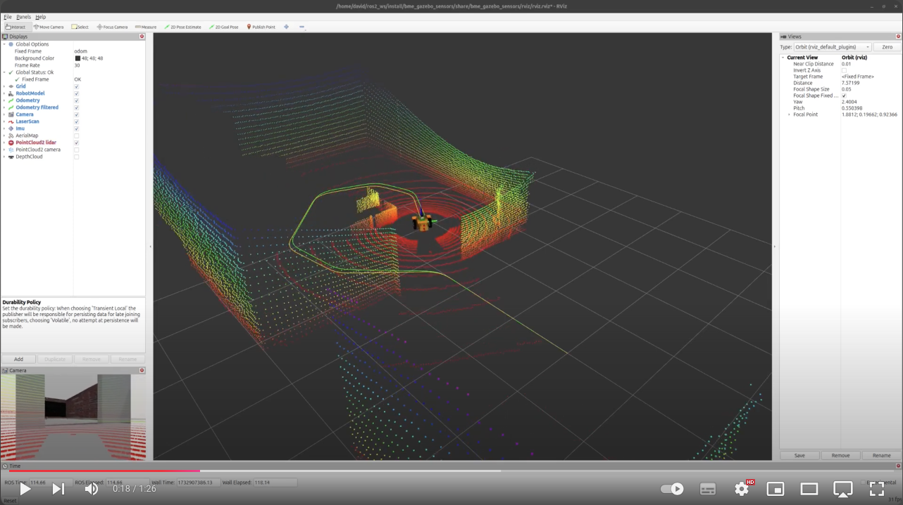

[//]: # (Image References)

[image1]: ./assets/starter-package.png "Starter package"
[image2]: ./assets/camera-first-try.png "Adding a camera"
[image3]: ./assets/camera.png "Adding a camera"
[image4]: ./assets/compressed.png "Adding a camera"
[image5]: ./assets/compressed-1.png "Adding a camera"
[image6]: ./assets/rqt-reconfigure.png "rqt reconfigure"
[image7]: ./assets/wide-angle.png "Wide angle camera"
[image8]: ./assets/wide-angle-1.png "Wide angle camera"
[image9]: ./assets/imu.png "IMU"
[image10]: ./assets/tf-tree.png "TF Tree"
[image11]: ./assets/odometry.png "Odometry"
[image12]: ./assets/navsat.png "Navsat"
[image13]: ./assets/new-york-madrid.png "New York - Madrid"
[image14]: ./assets/rviz-gps.png "RViz GPS"
[image15]: ./assets/rviz-gps-1.png "RViz GPS"
[image16]: ./assets/lidar.png "Lidar"
[image17]: ./assets/lidar-1.png "Lidar"
[image18]: ./assets/lidar-2.png "Lidar"
[image19]: ./assets/3d-lidar.png "Lidar"
[image20]: ./assets/3d-lidar-1.png "Lidar"
[image21]: ./assets/rgbd-camera.png "RGBD Camera"
[image22]: ./assets/depth-cloud.png "RGBD Camera"
[image23]: ./assets/depth-cloud-1.png "RGBD Camera"
[image24]: ./assets/depth-image.png "Depth image"
[image25]: ./assets/opencv.png "OpenCV"
[image26]: ./assets/red-ball.png "Red ball in Gazebo"
[image27]: ./assets/opencv-1.png "OpenCV"
[image28]: ./assets/opencv-2.png "OpenCV"

# Week 5-6: Gazebo sensors

## This is how far we will get by the end of this lesson: 
  <a href="https://youtu.be/0Xokl5dHRoQ"></a>  

  <a href="https://youtu.be/ELwRqeNR_NA"></a>  


# Table of Contents
1. [Introduction](#introduction)  
1.1. [Download ROS package](#download-ros-package)  
1.2. [Test the starter package](#test-the-starter-package)  
2. [Camera](#camera)  
2.1. [Image transport](#image-transport)  
2.2. [rqt reconfigure](#rqt-reconfigure)  
2.3. [Wide angle camera](#wide-angle-camera) 
3. [IMU](#imu)  
3.1. [Sensor fusion with ekf](#sensor-fusion-with-ekf)  
4. [GPS](#gps)  
4.1. [Haversine formula](#haversine-formula)  
4.2. [GPS waypoint following](#gps-waypoint-following) 
5. [Lidar](#lidar)  
5.1. [3D lidar](#3d-lidar) 
6. [RGBD camera](#rgbd-camera)  
7. [Image processing with OpenCV](#image-processing-with-opencv)  


# Introduction

After we built a simulated robot that we can drive around manually, we'll start adding various types of sensors to it. We'll see how to improve the odometry with sensor fusion using an IMI, how to follow GPS waypoints and we'll use various cameras and lidars.

## Download ROS package

The starting package of this lesson is very similar to where we just finished in the previous lesson, but don't forget that every lesson has its own starter package that you can donwload from GitHub. To download the starter package clone the following git repo with the `starter-branch` (using the `-b branch` flag) to your colcon workspace:
```bash
git clone -b starter-branch https://github.com/MOGI-ROS/Week-5-6-Gazebo-sensors.git
```

As we saw prevoiusly we can take a look what's inside the `bme_gazebo_sensors` package with the `tree` command!

```bash
.
├── CMakeLists.txt
├── package.xml
├── config
│   └── ekf.yaml
├── launch
│   ├── check_urdf.launch.py
│   ├── spawn_robot.launch.py
│   └── world.launch.py
├── meshes
│   ├── lidar.dae
│   ├── mogi_bot.dae
│   └── wheel.dae
├── rviz
│   ├── gps.rviz
│   ├── rviz.rviz
│   └── urdf.rviz
├── urdf
│   ├── materials.xacro
│   ├── mogi_bot.gazebo
│   └── mogi_bot.urdf
└── worlds
    ├── empty.sdf
    ├── home.sdf
    └── world.sdf
```

Let's see what will we do with the existing files and folders:
- `config`: We usually store parameters and large configuration files for ROS packages which aren't comfortable to handle from the launchfiles directly. In this lesson we store the configuration file for the sensor fusion using the `robot_localization` package's Extended Kalman Filter.
- `launch`: Default launch files are already part of the starting package, we can test the package with `spawn_robot.launch.py`.
- `meshes`: this folder contains the 3D models in `dae` format (collada mesh) that we use for our robot's body, wheels and lidar sensor.
- `rviz`: Pre-configured RViz2 layouts
- `urdf`: The URDF models of our robot, we'll extend the `mogi_bot.urdf` and `gazebo` files through this lesson
- `worlds`: default Gazebo worlds that we'll use in the simulations.

We have another package `bme_gazebo_sensors_py` for our python scripts:
```bash
.
├── bme_gazebo_sensors_py
│   ├── gps_waypoint_follower.py
│   ├── haversine_test.py
│   ├── image_republisher.py
│   └── __init__.py
├── package.xml
├── resource
│   └── bme_gazebo_sensors_py
├── setup.cfg
└── setup.py
```

## Test the starter package

After we downloaded the `starter-branch` from GitHub, let's rebuild the workspace and source the `install/setup.bash` file to make sure ROS and its tools are aware about the new package.

Then we can test the package with the usual launch file:
```bash
ros2 launch bme_gazebo_sensors spawn_robot.launch.py
```

And we can also start a teleop node:
```bash
ros2 run teleop_twist_keyboard teleop_twist_keyboard
```

![alt text][image1]

> In the next chapters we will add various sensors with many different properties, if it's unclear what kind of properties are available for which sensors, the official SDF reference manual is available [on the following link](http://sdformat.org/spec?elem=sensor&ver=1.6).

# Camera

To add a camera - and every other sensors later - we have to change 2 files:
1) The `mogi_bot.urdf`: we have to define the position, orientation and other physical properties of the camera in this file. This is not necessarily simulation dependent, we have to do these same changes in the urdf in case of a real robot with a real sensor.
2) The `mogi_bot.gazebo`: this is fully simulation dependent, we have to define the properties of the simulated camera in this file.

Let's add the camera first to the `mogi_bot.urdf`:

```xml
  <!-- STEP 7 - Camera -->
  <joint type="fixed" name="camera_joint">
    <origin xyz="0.225 0 0.075" rpy="0 0 0"/>
    <child link="camera_link"/>
    <parent link="base_link"/>
    <axis xyz="0 1 0" />
  </joint>

  <link name='camera_link'>
    <pose>0 0 0 0 0 0</pose>
    <inertial>
      <mass value="0.1"/>
      <origin xyz="0 0 0" rpy="0 0 0"/>
      <inertia
          ixx="1e-6" ixy="0" ixz="0"
          iyy="1e-6" iyz="0"
          izz="1e-6"
      />
    </inertial>

    <collision name='collision'>
      <origin xyz="0 0 0" rpy="0 0 0"/> 
      <geometry>
        <box size=".03 .03 .03"/>
      </geometry>
    </collision>

    <visual name='camera_link_visual'>
      <origin xyz="0 0 0" rpy="0 0 0"/>
      <geometry>
        <box size=".03 .03 .03"/>
      </geometry>
    </visual>

  </link>

  <gazebo reference="camera_link">
    <material>Gazebo/Red</material>
  </gazebo>

  <joint type="fixed" name="camera_optical_joint">
    <origin xyz="0 0 0" rpy="-1.5707 0 -1.5707"/>
    <child link="camera_link_optical"/>
    <parent link="camera_link"/>
  </joint>

  <link name="camera_link_optical">
  </link>
```

As we see above, the camera is a 3 x 3 x 3 cm cube, attached to the `base_link` with a fixed joint. But there is another thing, `camera_link_optical` which is connected to the `camera_link` through the `camera_optical_joint`! The purpose of this additional link and joint to solve the conflict between 2 different conventional coordinate systems:
- By default, URDF uses the right-handed coordinate system with X forward, Y left, and Z up.
- However, many ROS drivers and vision processing pipelines expect a camera’s optical axis to be aligned with Z forward, X to the right, and Y down.

`camera_optical_joint` applies a static rotation so that the camera data will be interpreted correctly by ROS tools that assume the Z-forward convention for image and depth sensors.

Now let's add the simulated camera into `mogi_bot.gazebo`:

```xml
  <gazebo reference="camera_link">
    <sensor name="camera" type="camera">
      <camera>
        <horizontal_fov>1.3962634</horizontal_fov>
        <image>
          <width>640</width>
          <height>480</height>
          <format>R8G8B8</format>
        </image>
        <clip>
          <near>0.1</near>
          <far>15</far>
        </clip>
        <noise>
          <type>gaussian</type>
          <!-- Noise is sampled independently per pixel on each frame.
               That pixel's noise value is added to each of its color
               channels, which at that point lie in the range [0,1]. -->
          <mean>0.0</mean>
          <stddev>0.007</stddev>
        </noise>
        <optical_frame_id>camera_link_optical</optical_frame_id>
        <camera_info_topic>camera/camera_info</camera_info_topic>
      </camera>
      <always_on>1</always_on>
      <update_rate>20</update_rate>
      <visualize>true</visualize>
      <topic>camera/image</topic>
    </sensor>
  </gazebo>
```

> Don't forget that the above code snippets must be placed within the already existing `<robot>` tag!

With the above plugin we define a couple of things for Gazebo, let's see the important ones one by one:
- `<gazebo reference="camera_link">`, we have to refer to the `camera_link` that we defined in the `urdf`
- `<horizontal_fov>1.3962634</horizontal_fov>`, the field of view of the simulated camera
- `width`, `height`, `format` and `update_rate`, properties of the video stream
- `<optical_frame_id>camera_link_optical</optical_frame_id>`, we have to use the `camera_link_optical` that we checked in details above to ensure the right static transformations between the coordinate systems
- `<camera_info_topic>camera/camera_info</camera_info_topic>`, certain tools like rviz requires a `camera_info` topic that describes the physical properties of the camera. The topic's name must match camera's topic (in this case both are `camera/...`)
- `<topic>camera/image</topic>`, we define the camera topic here

We can rebuild the workspace and try our changes, but it will not yet work. The camera's red cube model is visible but the topics aren't available for ROS (we can check it for example with `rqt`)

> It's possible to reload the urdf without restarting the nodes by setting the parameter from the terminal:
> ```bash
> ros2 param set /robot_state_publisher robot_description "$(xacro $(ros2 pkg prefix bme_gazebo_sensors)/share/bme_gazebo_sensors/urdf/mogi_bot.urdf)"
> ```

![alt text][image2]

With the new Gazebo simulator topics are not automatically forwarded as we already saw it in the previous lesson, we have to use the `parameter_bridge` of the `ros_gz_bridge` package. It has [a very detailed readme](https://github.com/gazebosim/ros_gz/tree/ros2/ros_gz_bridge) what kind of topic types can be forwarded between ROS and Gazebo. We have to extend the arguments of the `parameter_bridge` in our launch file:

```python
    # Node to bridge /cmd_vel and /odom
    gz_bridge_node = Node(
        package="ros_gz_bridge",
        executable="parameter_bridge",
        arguments=[
            "/clock@rosgraph_msgs/msg/Clock[gz.msgs.Clock",
            "/cmd_vel@geometry_msgs/msg/Twist@gz.msgs.Twist",
            "/odom@nav_msgs/msg/Odometry@gz.msgs.Odometry",
            "/joint_states@sensor_msgs/msg/JointState@gz.msgs.Model",
            "/tf@tf2_msgs/msg/TFMessage@gz.msgs.Pose_V",
            "/camera/image@sensor_msgs/msg/Image@gz.msgs.Image",
            "/camera/camera_info@sensor_msgs/msg/CameraInfo@gz.msgs.CameraInfo",

        ],
        output="screen",
        parameters=[
            {'use_sim_time': LaunchConfiguration('use_sim_time')},
        ]
    )
```

Let's rebuild the workspace and try it again:

```bash
ros2 launch bme_gazebo_sensors spawn_robot.launch.py
```

![alt text][image3]

## Image transport

We can see that both `/camera/camera_info` and `/camera/image` topics are forwarded. Although this is still not the ideal way to forward the camera image from Gazebo. ROS has a very handy feature with it's image transport protocol plugins, it's able to automatically compress the video stream in the background without any additional work on our side. But this feature doesn't work together with `parameter_bridge`. Without compression the 640x480 camera stream consumes almost 20 MB/s network bandwith which is unacceptable for a wireless mobile robot.

Therefore there is a dedicated `image_bridge` node in the `ros_gz_image` package. Let's modify our launch file to the following:

```python
    # Node to bridge /cmd_vel and /odom
    gz_bridge_node = Node(
        package="ros_gz_bridge",
        executable="parameter_bridge",
        arguments=[
            "/clock@rosgraph_msgs/msg/Clock[gz.msgs.Clock",
            "/cmd_vel@geometry_msgs/msg/Twist@gz.msgs.Twist",
            "/odom@nav_msgs/msg/Odometry@gz.msgs.Odometry",
            "/joint_states@sensor_msgs/msg/JointState@gz.msgs.Model",
            "/tf@tf2_msgs/msg/TFMessage@gz.msgs.Pose_V",
            #"/camera/image@sensor_msgs/msg/Image@gz.msgs.Image",
            "/camera/camera_info@sensor_msgs/msg/CameraInfo@gz.msgs.CameraInfo",

        ],
        output="screen",
        parameters=[
            {'use_sim_time': LaunchConfiguration('use_sim_time')},
        ]
    )

    # Node to bridge camera image with image_transport and compressed_image_transport
    gz_image_bridge_node = Node(
        package="ros_gz_image",
        executable="image_bridge",
        arguments=[
            "/camera/image",
        ],
        output="screen",
        parameters=[
            {'use_sim_time': LaunchConfiguration('use_sim_time'),
             'camera.image.compressed.jpeg_quality': 75},
        ],
    )
```

We also have to add the new node to the `launchDescription`:

```python
launchDescriptionObject.add_action(gz_image_bridge_node)
```

After rebuild we can try it using `rqt` and we will see huge improvement in the bandwith thanks to the `jpeg` compression.
![alt text][image4]

> If compressed images are not visible in rqt, you have to install the plugins you want to use:
> - `sudo apt install ros-jazzy-compressed-image-transport`: for jpeg and png compression
> - `sudo apt install ros-jazzy-theora-image-transport`: for theora compression
> - `sudo apt install ros-jazzy-zstd-image-transport`: for zstd compression

But we face another issue, this time in RViz, the uncompressed camera stream is visible as before but the compressed one isn't due to the following warning:

```
Camera Info
Expecting Camera Info on topic [/camera/image/camera_info]. No CameraInfo received. Topic may not exist.
```

It's because RViz always expect the `image` and `the camera_info` topics with the same prefix which works well for:

`/camera/image` &#8594; `/camera/camera_info`

But doesn't work for:

`/camera/image/compressed` &#8594; `/camera/image/camera_info`

because we don't publish the `camera_info` to that topic. We could remap the `camera_info` to that topic, but then the uncompressed image won't work in RViz, so it's not the desired solution.

But there is another useful tool that we can use, the `relay` node from the `topic_tools` package:

```python
    # Relay node to republish /camera/camera_info to /camera/image/camera_info
    relay_camera_info_node = Node(
        package='topic_tools',
        executable='relay',
        name='relay_camera_info',
        output='screen',
        arguments=['camera/camera_info', 'camera/image/camera_info'],
        parameters=[
            {'use_sim_time': LaunchConfiguration('use_sim_time')},
        ]
    )
```

Of course, don't forget to add it to the `launchDescription` too:
```python
launchDescriptionObject.add_action(relay_camera_info_node)
```

> If `topic_tools` is not installed you can install it with `sudo apt install ros-jazzy-topic-tools`

Rebuild the workspace and let's try it!

```bash
ros2 launch bme_gazebo_sensors spawn_robot.launch.py
```
![alt text][image5]

## rqt reconfigure

We already set up the `jpeg` quality in the `image_bridge` node with the following parameter:
```python
'camera.image.compressed.jpeg_quality': 75
```

But how do we know what is the name of the parameter and what other settings do we can change? To see that we will use the `rqt_reconfigure` node.

First start the simulation:
```bash
ros2 launch bme_gazebo_sensors spawn_robot.launch.py
```

Then start rqt_reconfigure:
```bash
ros2 run rqt_reconfigure rqt_reconfigure
```

![alt text][image6]

We can play with the parameters here, change the compression or the algorithm as we wish and we can monitor it's impact with `rqt`.

## Wide angle camera

Using wide angle or fisheye lens on mobile robots is quite common, but With the conventional camera simulation we cannot simply increase the field of view to get a wide angle distortion. To achieve this we need a different plugin, the `wideangle_camera`. Let's replace the camera simulation in the `mogi_bot.gazebo` to this one:

```xml
  <gazebo reference="camera_link">
    <sensor name="wideangle_camera" type="wideanglecamera">
      <camera>
        <horizontal_fov>3.14</horizontal_fov>
        <image>
          <width>640</width>
          <height>480</height>
        </image>
        <clip>
          <near>0.1</near>
          <far>15</far>
        </clip>
        <optical_frame_id>camera_link_optical</optical_frame_id>
        <camera_info_topic>camera/camera_info</camera_info_topic>
      </camera>
      <always_on>1</always_on>
      <update_rate>20</update_rate>
      <topic>camera/image</topic>
      <gz_frame_id>camera_link</gz_frame_id>
    </sensor>
  </gazebo>
```

After rebuilding the workspace we can try it out:

```bash
ros2 launch bme_gazebo_sensors spawn_robot.launch.py
```

![alt text][image7]

As image it works in both `rviz` and in `rqt` but as a camera it doesn't work in RViz due to the following error:
```bash
[rviz2-2] [INFO] [1736112172.091762692] [rviz]: Message Filter dropping message: frame 'mogi_bot/base_footprint/wideangle_camera' at time 137.352 for reason 'discarding message because the queue is full'
```

As of ROS2 Jazzy and Gazebo Harmonic `wideangle_camera` has a bug and it ignores the `optical_frame_id` tag therefore RViz rejects visualizing it, we can also take a look on the header of the image topic:

![alt text][image8]

If we want to fix this problem we can re-publish the message with a corrected header, I created a very simply script that does this, it's part of the starter package and we can run the node with the following command:

```bash
ros2 run bme_gazebo_sensors_py image_republisher
```


# IMU

An Inertial Measurement Unit (IMU) typically consists of a 3-axis accelerometer, 3-axis gyroscope, and sometimes a 3-axis magnetometer. It measures linear acceleration, angular velocity, and possibly magnetic heading (orientation). It's important to remember that it's not possible to measure unform motion with an IMU where the velocity is constant (acceleration is zero) and there is no change in the orientation. Therefore we cannot replace the odometry of the robot with an IMU but with the right technique we can combine these two into a more precise measurement unit.

But first, let's add our IMU to the `urdf`:
```xml
  <!-- STEP 8 - IMU -->
  <joint name="imu_joint" type="fixed">
    <origin xyz="0 0 0" rpy="0 0 0" />
    <parent link="base_link"/>
    <child link="imu_link" />
  </joint>

  <link name="imu_link">
  </link>
```

Which is a simple link and a fixed joint in the center of the base link. Let's add the plugin to the `mogi_bot.gazebo` file too:

```xml
  <gazebo reference="imu_link">
    <sensor name="imu" type="imu">
      <always_on>1</always_on>
      <update_rate>50</update_rate>
      <visualize>true</visualize>
      <topic>imu</topic>
      <enable_metrics>true</enable_metrics>
      <gz_frame_id>imu_link</gz_frame_id>
    </sensor>
  </gazebo>
```

With adding the IMU we aren't done yet, with the new Gazebo we also have to make sure that our simulated world has the right plugins within its `<world>` tag. In this lesson I already added the plugins to each world files, but if you use your won custom made world, don't forget to add the plugins!

```xml
    <plugin
      filename="gz-sim-imu-system"
      name="gz::sim::systems::Imu">
    </plugin>
```

Before we try it out we also have to bridge the topics from Gazebo towards ROS using the `parameter_bridge`. Let's add the `imu` topic - or what we defined as `<topic>` in the Gazebo plugin - to the parameter bridge, rebuild the workspace and we are ready to test it!

> To properly visualize IMU in RViz install the following plugin: `sudo apt install ros-jazzy-rviz-imu-plugin`

```python
    # Node to bridge /cmd_vel and /odom
    gz_bridge_node = Node(
        package="ros_gz_bridge",
        executable="parameter_bridge",
        arguments=[
            "/clock@rosgraph_msgs/msg/Clock[gz.msgs.Clock",
            "/cmd_vel@geometry_msgs/msg/Twist@gz.msgs.Twist",
            "/odom@nav_msgs/msg/Odometry@gz.msgs.Odometry",
            "/joint_states@sensor_msgs/msg/JointState@gz.msgs.Model",
            "/tf@tf2_msgs/msg/TFMessage@gz.msgs.Pose_V",
            #"/camera/image@sensor_msgs/msg/Image@gz.msgs.Image",
            "/camera/camera_info@sensor_msgs/msg/CameraInfo@gz.msgs.CameraInfo",
            "imu@sensor_msgs/msg/Imu@gz.msgs.IMU",
        ],
        output="screen",
        parameters=[
            {'use_sim_time': LaunchConfiguration('use_sim_time')},
        ]
    )
```

```bash
ros2 launch bme_gazebo_sensors spawn_robot.launch.py
```

![alt text][image9]

## Sensor fusion with ekf

Sensor fusion is the process of combining data from multiple sensors (possibly of different types) to obtain a more accurate or more complete understanding of a system or environment than could be achieved by using the sensors separately. By merging redundant and complementary information, sensor fusion reduces uncertainty, mitigates individual sensor errors, and provides robust state estimates (e.g., position, velocity, orientation).

A Kalman Filter (KF) is a mathematical algorithm that estimates the internal state of a system (e.g., position, velocity) based on noisy measurements and a predictive model of how the system behaves. The standard (linear) Kalman Filter assumes the system dynamics (state transitions) and measurement models are linear.

Real-world systems—especially those involving orientation, rotations, or non-linear sensor models (e.g., fusing IMU acceleration, odometry, GPS position, magnetometer) often do not follow purely linear equations. That’s where the Extended Kalman Filter (EKF) comes in. It's a widely used sensor fusion algorithm that handles non-linear system and measurement models by locally linearizing them. Luckily we don't have to bother too much about its implementation in this lesson because we'll use a package that is widely used in robotics applications for years around the world. It's the [robot localization package](https://docs.ros.org/en/melodic/api/robot_localization/html/index.html) that you can install with the following command:
```bash
sudo apt install ros-jazzy-robot-localization
```

To configure `robot_localization` package can be tricky in the beginning, but I already created a config yaml file in the `config` folder based on the official guidelines that will do the job in this lesson. Important to notice that `robot_localization` will publish a filtered odometry topic and also a transformation between the robot's `base_link` and this improved odometry coordinate system.

From the `rqt_tf_tree` tool we cannot tell which node is broadcasting the TF:
![alt text][image10]
> Run `rqt_tf_tree` with the following command: `ros2 run rqt_tf_tree rqt_tf_tree`

But we can take a look into the `/tf` topic which nodes are publishing:
`ros2 topic info /tf --verbose`

And we will see 2 publisher nodes, the `ros_gz_bridge` and the `robot_state_publisher` as we expected.

Since a robot cannot have 2 odomnetry transformation we have to stop Gazebo doing it. The easiest way is simply not bridging it anymore with the `parameter_bridge`.

```python
    # Node to bridge /cmd_vel and /odom
    gz_bridge_node = Node(
        package="ros_gz_bridge",
        executable="parameter_bridge",
        arguments=[
            "/clock@rosgraph_msgs/msg/Clock[gz.msgs.Clock",
            "/cmd_vel@geometry_msgs/msg/Twist@gz.msgs.Twist",
            "/odom@nav_msgs/msg/Odometry@gz.msgs.Odometry",
            "/joint_states@sensor_msgs/msg/JointState@gz.msgs.Model",
            #"/tf@tf2_msgs/msg/TFMessage@gz.msgs.Pose_V",
            #"/camera/image@sensor_msgs/msg/Image@gz.msgs.Image",
            "/camera/camera_info@sensor_msgs/msg/CameraInfo@gz.msgs.CameraInfo",
            "imu@sensor_msgs/msg/Imu@gz.msgs.IMU",
        ],
        output="screen",
        parameters=[
            {'use_sim_time': LaunchConfiguration('use_sim_time')},
        ]
    )
```

And then let's add the `robot_localization` to the launch file:

```python
    ekf_node = Node(
        package='robot_localization',
        executable='ekf_node',
        name='ekf_filter_node',
        output='screen',
        parameters=[
            os.path.join(pkg_bme_gazebo_sensors, 'config', 'ekf.yaml'),
            {'use_sim_time': LaunchConfiguration('use_sim_time')},
             ]
    )
```

And of course, add the new node to the `launchDescription` object:

```python
launchDescriptionObject.add_action(ekf_node)
```

Rebuild the workspace and let's try it out!

```bash
ros2 launch bme_gazebo_sensors spawn_robot.launch.py
```

As we expected the `tf_tree` looks the same, but if we check the publishers of the `/tf` we'll see the following nodes: `ekf_filter_node` and `robot_state_publisher`. We can also see that there is a `/odometry/filtered` topic published by the `ekf_filter_node`.

But how could we validate that odometry is improved with adding the ekf sensor fusion? We can use the `mogi_trajectory_server` package for that. By default the trajectory server gets its data from the `/tf` but there is another node in the package that can subscribe to the original `/odom` topic which is basically identical to the old transformation between the `base_link` and `odom` frame. Let's add it to the launch file:

```python
    trajectory_odom_topic_node = Node(
        package='mogi_trajectory_server',
        executable='mogi_trajectory_server_topic_based',
        name='mogi_trajectory_server_odom_topic',
        parameters=[{'trajectory_topic': 'trajectory_raw'},
                    {'odometry_topic': 'odom'}]
    )
```

Also add it to the `launchDescription`:

```python
launchDescriptionObject.add_action(trajectory_odom_topic_node)
```

Rebuild the workspace, restart the simulation and let's see the 2 trajectories in RViz:
![alt text][image11]

We can see that the yellow (raw) odometry starts drifting away from the corrected one very quickly and we can easily bring the robot into a special situation if we drive on a curve and hit the wall. In this case the robot is unable to move and the wheels are slipping. The raw odometry believes from the encoder signals that the robot is still moving on a curve while the odometry after the ekf sensor fusion will believe that the robot moves forward straight. Although none of them are correct, but remember, neither the IMU and neither the odometry can tell if the robot is doing an uniform movement or it's stand still. At least the ekf is able to properly tell that the robot's orientation is not changing regardless what the encoders measure.


# GPS

Just as we did for the GPS we add another simple link and joint for the simulated GPS in the `urdf`:
```xml
  <!-- STEP 9 - GPS -->
  <joint name="navsat_joint" type="fixed">
    <origin xyz="0 0 0" rpy="0 0 0" />
    <parent link="base_link"/>
    <child link="navsat_link" />
  </joint>

  <link name="navsat_link">
  </link>
```

And we add the Gazebo plugin:

```xml
  <gazebo reference="navsat_link">
    <sensor name="navsat" type="navsat">
      <always_on>1</always_on>
      <update_rate>1</update_rate>
      <topic>navsat</topic>
      <gz_frame_id>navsat_link</gz_frame_id>
    </sensor>
  </gazebo>
```

We also have to add a plugin the worlds we use similarly to the IMU and furthermore we have to define what is the latitude and longitude of the centerpoint of the simulated world.

```xml
    <plugin
      filename="gz-sim-navsat-system"
      name="gz::sim::systems::NavSat">
    </plugin>
    <!-- Set the coordinates for the world origin -->
    <spherical_coordinates>
      <surface_model>EARTH_WGS84</surface_model>
      <world_frame_orientation>ENU</world_frame_orientation>
      <latitude_deg>47.478950</latitude_deg>
      <longitude_deg>19.057785</longitude_deg>
      <elevation>0</elevation>
      <heading_deg>0</heading_deg>
    </spherical_coordinates>
```

When all of these are done, we have to still extend the topic forwarding in the `parameter_bridge`:

```python
    # Node to bridge /cmd_vel and /odom
    gz_bridge_node = Node(
        package="ros_gz_bridge",
        executable="parameter_bridge",
        arguments=[
            "/clock@rosgraph_msgs/msg/Clock[gz.msgs.Clock",
            "/cmd_vel@geometry_msgs/msg/Twist@gz.msgs.Twist",
            "/odom@nav_msgs/msg/Odometry@gz.msgs.Odometry",
            "/joint_states@sensor_msgs/msg/JointState@gz.msgs.Model",
            #"/tf@tf2_msgs/msg/TFMessage@gz.msgs.Pose_V",
            #"/camera/image@sensor_msgs/msg/Image@gz.msgs.Image",
            "/camera/camera_info@sensor_msgs/msg/CameraInfo@gz.msgs.CameraInfo",
            "imu@sensor_msgs/msg/Imu@gz.msgs.IMU",
            "/navsat@sensor_msgs/msg/NavSatFix@gz.msgs.NavSat",
        ],
        output="screen",
        parameters=[
            {'use_sim_time': LaunchConfiguration('use_sim_time')},
        ]
    )
```

Let's rebuild the workspace and check the `navsat` topic.
![alt text][image12]

But what can we do with this simulated GPS?

## Haversine formula
Before we can move forward to practical application we have to learn the haversine formula. It is used to calculate the great-circle distance between two points on a sphere (e.g. the Earth) from their latitudes and longitudes. It accounts for the spherical shape of the planet, making it more accurate than simple Euclidean distance formulas when dealing with geographical coordinates. By using half-angle trigonometric functions, it avoids numerical issues for small distances and is thus a popular choice in navigation and mapping applications.

The haversine formula results in a distance and bearing between 2 points on the sphere, where the bearing is measured clockwise from north. 0° bearing corresponds to North, 90° bearing corresponds to East, etc.

Let's see the haversine formula implemented in python and we can try it with a few different cities:

```python
#!/usr/bin/env python3

import math

def haversine(lat1_deg, lon1_deg, lat2_deg, lon2_deg):
    # 0. Radius of earth in km
    R = 6378.137
    # 1. Convert from degrees to radians
    lat1 = math.radians(lat1_deg)
    lon1 = math.radians(lon1_deg)
    lat2 = math.radians(lat2_deg)
    lon2 = math.radians(lon2_deg)

    # 2. Haversine formula for distance
    dlat = lat2 - lat1
    dlon = lon2 - lon1

    a = math.sin(dlat / 2) ** 2 + math.cos(lat1) * math.cos(lat2) * math.sin(dlon / 2) ** 2
    c = 2 * math.asin(math.sqrt(a))
    distance_km = R * c

    # 3. Initial bearing calculation (forward azimuth)
    y = math.sin(dlon) * math.cos(lat2)
    x = math.cos(lat1) * math.sin(lat2) - math.sin(lat1) * math.cos(lat2) * math.cos(dlon)
    bearing_rad = math.atan2(y, x)  # range -π to +π

    # 4. Convert to degrees [0, 360)
    bearing_deg = math.degrees(bearing_rad)
    bearing_deg = (bearing_deg + 360) % 360  # normalize

    return distance_km, bearing_deg

# (latitude, longitude)
new_york   = (40.66964055858272,  -73.2918438988026)
montreal   = (45.499155994690476, -73.5187471087869)
madrid     = (40.42545972472332, -3.577711461862623)
glasgow    = (55.86725614373743,  -4.22935951146214)
copenhagen = (55.711247305054904, 12.585837172964045)


print("New York to Montreal: ", haversine(new_york[0],new_york[1],montreal[0],montreal[1]))    # Should be 540 km
print("New York to Madrid: ", haversine(new_york[0],new_york[1],madrid[0],madrid[1]))          # Should be 5730 km
print("Glasgow to Madrid: ", haversine(glasgow[0],glasgow[1],madrid[0],madrid[1]))             # Should be 1720 km
print("Copenhagen to Glasgow: ", haversine(copenhagen[0],copenhagen[1],glasgow[0],glasgow[1])) # Should be 1050 km
```

The results are the following:
```python
$ python haversine_test.py 
New York to Montreal:  (537.9349305919243, 358.1117237377836)
New York to Madrid:  (5730.769414305992, 65.87069002082472)
Glasgow to Madrid:  (1719.634568091304, 178.13731351039723)
Copenhagen to Glasgow:  (1049.9843791993976, 277.9072459115459)
```

Which is pretty much what we expected, except the bearing from New York to Madrid. Madrid is just perfectly to the east from New York, but the bearing isn't even close to 90°. Great-circle navigation on a sphere (or ellipsoid) doesn’t always match our intuitive “straight line on a flat map”. Despite New York and Madrid having similar latitudes, the difference in longitude is large (roughly 70° of longitude). To reach Madrid along the shortest path, the great-circle solution will “curve” somewhat. The initial bearing in a great-circle sense is typically northeast (less than 90°), [because you tend to move slightly northward initially](https://www.greatcirclemap.com/globe?fbclid=IwAR06f4ZtxJYeLPikyCc87FomfFToelVzD6-4jrdiYp5RIo4GIQ0a-Vb3MUE&routes=%20JFK-MAD) before you “swing” back southward across the Atlantic. This yields an initial bearing from New York to Madrid around 66° which is noticeably less than 90°.

![alt text][image13]


## GPS waypoint following

Let's get back to our lesson and navigate through a series of GPS waypoints using the above formula. Before we deep dive into our new node let's make sure that the necessary RViz plugin is installed to show an aerial map in RViz. This plugin can use various map services ([e.g. OpenStreetMap in our case](https://www.openstreetmap.org/search?lat=47.479099&lon=19.057811)), and you can find the details about its setup [on its GitHub page](https://github.com/nobleo/rviz_satellite).
```bash
sudo apt install ros-jazzy-rviz-satellite
```

Let's spawn our robot in an empty world with a different RViz config where the plugin is already configured:

```bash
ros2 launch bme_gazebo_sensors spawn_robot.launch.py world:=empty.sdf rviz_config:=gps.rviz x:=0.0 y:=0.0 yaw:=0.0
```

![alt text][image14]

Let's take a look on the `gps_waypoint_follower.py` which is part of this lesson. It uses the exact same haversine function, but this time we'll use it in meters and radian instead of km and degrees.

To get the yaw angle of the robot we will have to convert the robot's orientation in quaternion into Euler angles. Make sure that the necessary package is installed: `sudo apt install ros-jazzy-tf-transformations`
```python
    def imu_callback(self, msg):
        orientation_q = msg.orientation
        orientation_list = [orientation_q.x, orientation_q.y, orientation_q.z, orientation_q.w]
        (self.roll, self.pitch, self.yaw) = euler_from_quaternion (orientation_list)
```

Also note that the default convention for ROS for rotations around the z-axis follows the right hand rule. Consequently, rotating counterclockwise about the z-axis corresponds to a positive increase in yaw, while rotating clockwise corresponds to a negative yaw change. But bearing is a compass-like convention: 0° at North, increasing when turning clockwise. So we have to make sure that the we convert bearing to the same convention as the robot's yaw angle.

Let's start the node:

```bash
ros2 run bme_gazebo_sensors_py gps_waypoint_follower
```

The node will navigate through 4 waypoints and stops after that. 

![alt text][image15]

# Lidar 

LIDAR (an acronym for “Light Detection and Ranging” or “Laser Imaging, Detection, and Ranging”) is a sensing technology that uses laser light to measure distances. LIDAR sensor typically emits pulses of laser light in a scanning pattern (2D or 3D) and measures how long it takes for the light to return after hitting nearby objects. From this, the system computes distances to obstacles or surfaces in the environment. By continuously scanning the surroundings, the LIDAR provides a 2D or 3D map of distances to any objects around the robot. Lidars are simple and important sensors of almost every mobile robot applications, it's widely used in Simultaneous Localization and Mapping (SLAM) algorithms which use LIDAR scans to build a map of the environment in real time while also estimating the robot’s pose (position and orientation) within that map.

First, we start with a simple 2D lidar, let's add it to the urdf:

```xml
  <!-- STEP 10 - Lidar -->
  <joint type="fixed" name="scan_joint">
    <origin xyz="0.0 0 0.15" rpy="0 0 0"/>
    <child link="scan_link"/>
    <parent link="base_link"/>
    <axis xyz="0 1 0" rpy="0 0 0"/>
  </joint>

  <link name='scan_link'>
    <inertial>
      <mass value="1e-5"/>
      <origin xyz="0 0 0" rpy="0 0 0"/>
      <inertia
          ixx="1e-6" ixy="0" ixz="0"
          iyy="1e-6" iyz="0"
          izz="1e-6"
      />
    </inertial>
    <collision name='collision'>
      <origin xyz="0 0 0" rpy="0 0 0"/> 
      <geometry>
        <box size=".1 .1 .1"/>
      </geometry>
    </collision>

    <visual name='scan_link_visual'>
      <origin xyz="0 0 0" rpy="0 0 0"/>
      <geometry>
        <mesh filename = "package://bme_gazebo_sensors/meshes/lidar.dae"/>
      </geometry>
    </visual>
  </link>
```

Then add the plugin to the `mogi_bot.gazebo` file:

```xml
  <gazebo reference="scan_link">
    <sensor name="gpu_lidar" type="gpu_lidar">
      <update_rate>10</update_rate>
      <topic>scan</topic>
      <gz_frame_id>scan_link</gz_frame_id>
      <lidar>
        <scan>
          <horizontal>
            <samples>720</samples>
            <!--(max_angle-min_angle)/samples * resolution -->
            <resolution>1</resolution>
            <min_angle>-3.14156</min_angle>
            <max_angle>3.14156</max_angle>
          </horizontal>
          <!-- Dirty hack for fake lidar detections with ogre 1 rendering in VM -->
          <!-- <vertical>
              <samples>3</samples>
              <min_angle>-0.001</min_angle>
              <max_angle>0.001</max_angle>
          </vertical> -->
        </scan>
        <range>
          <min>0.05</min>
          <max>10.0</max>
          <resolution>0.01</resolution>
        </range>
        <noise>
            <type>gaussian</type>
            <mean>0.0</mean>
            <stddev>0.01</stddev>
        </noise>
        <frame_id>scan_link</frame_id>
      </lidar>
      <always_on>1</always_on>
      <visualize>true</visualize>
    </sensor>
  </gazebo>
```

> If you are using OGRE 1 rendering in VM and lidar reading is not properly rendered (it renders only within a small circle around the sensor) you can try to enable 3 vertical samples with very small vertical angles.

Before we can test our lidar we have to update the `parameter_bridge` to forward the lidar scan topic:

```python
    # Node to bridge /cmd_vel and /odom
    gz_bridge_node = Node(
        package="ros_gz_bridge",
        executable="parameter_bridge",
        arguments=[
            "/clock@rosgraph_msgs/msg/Clock[gz.msgs.Clock",
            "/cmd_vel@geometry_msgs/msg/Twist@gz.msgs.Twist",
            "/odom@nav_msgs/msg/Odometry@gz.msgs.Odometry",
            "/joint_states@sensor_msgs/msg/JointState@gz.msgs.Model",
            #"/tf@tf2_msgs/msg/TFMessage@gz.msgs.Pose_V",
            #"/camera/image@sensor_msgs/msg/Image@gz.msgs.Image",
            "/camera/camera_info@sensor_msgs/msg/CameraInfo@gz.msgs.CameraInfo",
            "/imu@sensor_msgs/msg/Imu@gz.msgs.IMU",
            "/navsat@sensor_msgs/msg/NavSatFix@gz.msgs.NavSat",
            "/scan@sensor_msgs/msg/LaserScan@gz.msgs.LaserScan",
        ],
        output="screen",
        parameters=[
            {'use_sim_time': LaunchConfiguration('use_sim_time')},
        ]
    )
```

Let's try it in the simulation!

```bash
ros2 launch bme_gazebo_sensors spawn_robot.launch.py
```

![alt text][image16]

We can also verify the rendering of lidars in Gazebo with the `Visualize Lidar` tool:

![alt text][image17]

If we increase decay time of the visualization of lidar scans and we drive around the robot we can do a very simple "mapping" of the environment. Although in the next lesson we will see that mapping algorithms are more complicated, usually this a good quick and dirty test on real robots if odometry, lidar scan and the other components are working well together.

![alt text][image18]

## 3D lidar

If we want to simulate a 3D lidar we only have to increase the number of vertical samples together with the minimum and maximum angles. For example the following vertical parameters are matching a Velodyne VLP-32 sensor:

```xml
          <vertical>
              <samples>32</samples>
              <min_angle>-0.5353</min_angle>
              <max_angle>0.1862</max_angle>
          </vertical>
```

To properly visualize a 3D point cloud in RViz we have to forward one more topic with `parameter_bridge`:

```python
    # Node to bridge /cmd_vel and /odom
    gz_bridge_node = Node(
        package="ros_gz_bridge",
        executable="parameter_bridge",
        arguments=[
            "/clock@rosgraph_msgs/msg/Clock[gz.msgs.Clock",
            "/cmd_vel@geometry_msgs/msg/Twist@gz.msgs.Twist",
            "/odom@nav_msgs/msg/Odometry@gz.msgs.Odometry",
            "/joint_states@sensor_msgs/msg/JointState@gz.msgs.Model",
            #"/tf@tf2_msgs/msg/TFMessage@gz.msgs.Pose_V",
            #"/camera/image@sensor_msgs/msg/Image@gz.msgs.Image",
            "/camera/camera_info@sensor_msgs/msg/CameraInfo@gz.msgs.CameraInfo",
            "/imu@sensor_msgs/msg/Imu@gz.msgs.IMU",
            "/navsat@sensor_msgs/msg/NavSatFix@gz.msgs.NavSat",
            "/scan@sensor_msgs/msg/LaserScan@gz.msgs.LaserScan",
            "/scan/points@sensor_msgs/msg/PointCloud2@gz.msgs.PointCloudPacked",
        ],
        output="screen",
        parameters=[
            {'use_sim_time': LaunchConfiguration('use_sim_time')},
        ]
    )
```

```bash
ros2 launch bme_gazebo_sensors spawn_robot.launch.py
```
![alt text][image19]

We can also increase the decay time just as we did with the 2D points.

![alt text][image20]


# RGBD Camera

Another way to get 3D pointclouds around the robot is using an RGBD camera which can tell not just the color but also the depth of every single pixel. To add an RGBD camera let's replace the conventional camera with this one:

```xml
  <gazebo reference="camera_link">
    <sensor name="rgbd_camera" type="rgbd_camera">
      <camera>
        <horizontal_fov>1.25</horizontal_fov>
        <image>
          <width>320</width>
          <height>240</height>
        </image>
        <clip>
          <near>0.3</near>
          <far>15</far>
        </clip>
        <optical_frame_id>camera_link_optical</optical_frame_id>
      </camera>
      <always_on>1</always_on>
      <update_rate>20</update_rate>
      <visualize>true</visualize>
      <topic>camera</topic>
      <gz_frame_id>camera_link</gz_frame_id>
    </sensor>
  </gazebo>
```

And let's forward 2 topics with the `parameter_bridge`:
- the `/camera/depth_image` which provides a grayscale camera stream where the grayscale values correspond to the distance of the individual pixels. RViz is able to render depth image topic and the color image topic together as a depth cloud.
![alt text][image24]

- the `/camera/points` which is a 3D pointcloud, the same type as the 3D lidar's point cloud. We can visualize it in RViz just as any point clouds.

Let's add the topics to the parameter bridge:

```python
    # Node to bridge /cmd_vel and /odom
    gz_bridge_node = Node(
        package="ros_gz_bridge",
        executable="parameter_bridge",
        arguments=[
            "/clock@rosgraph_msgs/msg/Clock[gz.msgs.Clock",
            "/cmd_vel@geometry_msgs/msg/Twist@gz.msgs.Twist",
            "/odom@nav_msgs/msg/Odometry@gz.msgs.Odometry",
            "/joint_states@sensor_msgs/msg/JointState@gz.msgs.Model",
            #"/tf@tf2_msgs/msg/TFMessage@gz.msgs.Pose_V",
            #"/camera/image@sensor_msgs/msg/Image@gz.msgs.Image",
            "/camera/camera_info@sensor_msgs/msg/CameraInfo@gz.msgs.CameraInfo",
            "/imu@sensor_msgs/msg/Imu@gz.msgs.IMU",
            "/navsat@sensor_msgs/msg/NavSatFix@gz.msgs.NavSat",
            "/scan@sensor_msgs/msg/LaserScan@gz.msgs.LaserScan",
            "/scan/points@sensor_msgs/msg/PointCloud2@gz.msgs.PointCloudPacked",
            "/camera/depth_image@sensor_msgs/msg/Image@gz.msgs.Image",
            "/camera/points@sensor_msgs/msg/PointCloud2@gz.msgs.PointCloudPacked",
        ],
        output="screen",
        parameters=[
            {'use_sim_time': LaunchConfiguration('use_sim_time')},
        ]
    )
```

Rebuild the workspace and let's start the simulation:
```bash
ros2 launch bme_gazebo_sensors spawn_robot.launch.py
```

![alt text][image21]


The orientation of 3D point cloud isn't correct because it's interpreted in the `camera_link_optical` frame, let's change the Gazebo plugin a little bit:

```xml
        <optical_frame_id>camera_link</optical_frame_id>
```

After rebuild we can try it out:

![alt text][image22]

Just as we saw before we can adjust the decay time to keep rendering the previous points:

![alt text][image23]


> Gazebo support many more different sensors that we won't cover in this lesson, you can find more examples [on the following link](https://github.com/gazebosim/gz-sim/tree/gz-sim8/examples/worlds).

# Image processing with OpenCV

In this last chapter we'll learn how to implement our own node for image processing using ROS and OpenCV.
First, let's switch back to a conventional camera and create the new node within the `bme_gazebo_sensors_py` package.

> If we want to use OpenCV and other python modules from a python virtual environment, we'll have to add the following to the `setup.cfg` file inside our python package:
> ```ini
> [build_scripts]
> executable = /usr/bin/env python3
> ```

I'll name it `chase_the_ball.py` because it will make our robot following a simulated red ball. But as the first step we just write a node that subscribes to the `/camera/image` topic, converts it to OpenCV compatible frame and dispays it using OpenCV:

```python
import rclpy
from rclpy.node import Node
from sensor_msgs.msg import Image
from cv_bridge import CvBridge
from geometry_msgs.msg import Twist
import cv2
import numpy as np
import threading

class ImageSubscriber(Node):
    def __init__(self):
        super().__init__('image_subscriber')
        
        # Create a subscriber with a queue size of 1 to only keep the last frame
        self.subscription = self.create_subscription(
            Image,
            'camera/image',
            self.image_callback,
            1  # Queue size of 1
        )

        self.publisher = self.create_publisher(Twist, 'cmd_vel', 10)
        
        # Initialize CvBridge
        self.bridge = CvBridge()
        
        # Variable to store the latest frame
        self.latest_frame = None       

        # Flag to control the display loop
        self.running = True 

    def image_callback(self, msg):
        """Callback function to receive and store the latest frame."""
        # Convert ROS Image message to OpenCV format and store it
        self.latest_frame = self.bridge.imgmsg_to_cv2(msg, "bgr8")

    def display_image(self):
        """Main loop to process and display the latest frame."""
        # Create a single OpenCV window
        cv2.namedWindow("frame", cv2.WINDOW_NORMAL)
        cv2.resizeWindow("frame", 800,600)

        while rclpy.ok():
            # Check if there is a new frame available
            if self.latest_frame is not None:

                # Process the current image
                self.process_image(self.latest_frame)

                # Show the latest frame
                cv2.imshow("frame", self.latest_frame)
                self.latest_frame = None  # Clear the frame after displaying

            # Check for quit key
            if cv2.waitKey(1) & 0xFF == ord('q'):
                self.running = False
                break

            rclpy.spin_once(self, timeout_sec=0.05)

        # Close OpenCV window after quitting
        cv2.destroyAllWindows()
        self.running = False

    def process_image(self, img):
        """Image processing task."""
        return

def main(args=None):

    print("OpenCV version: %s" % cv2.__version__)

    rclpy.init(args=args)
    node = ImageSubscriber()
    
    try:
        node.display_image()  # Run the display loop
    except KeyboardInterrupt:
        pass
    finally:
        node.destroy_node()
        rclpy.shutdown()

if __name__ == '__main__':
    main()
```

> We can quit the node if we press the `q` key on the OpenCV window!

You have to install OpenCV for your python using `pip` or `pipx` depending your setup for python virtual environments, during these lessons I'm using OpenCV version 4.6.0. You also have to install the ROS-OpenCV bridge with `sudo apt install ros-jazzy-cv-bridge`.

When everything is installed we have to add the new node to `entry_points` of the `setup.py`:

```python
    entry_points={
        'console_scripts': [
            'image_republisher = bme_gazebo_sensors_py.image_republisher:main',
            'gps_waypoint_follower = bme_gazebo_sensors_py.gps_waypoint_follower:main',
            'chase_the_ball = bme_gazebo_sensors_py.chase_the_ball:main',
        ],
    },
```

Let's try it out after building the workspace, first we start the simulation then in another terminal we run the new node:
```bash
ros2 run bme_gazebo_sensors_py chase_the_ball
```

![alt text][image25]

As you can see the `process_image()` function is now just a placeholder and we'll start implementing more features within this function later, but first let's extend the node with better handling of the subscription to the image topic. If `process_image()` will take more time to run it will also block the execution of `rclpy.spin_once(self, timeout_sec=0.05)` that is needed to trigger the `image_callback()`. So let's move the spin functionality to a separate thread:

Let's change the `__init__()` constructor first:
```python
    def __init__(self):
        super().__init__('image_subscriber')
        
        # Create a subscriber with a queue size of 1 to only keep the last frame
        self.subscription = self.create_subscription(
            Image,
            'camera/image',
            self.image_callback,
            1  # Queue size of 1
        )

        self.publisher = self.create_publisher(Twist, 'cmd_vel', 10)
        
        # Initialize CvBridge
        self.bridge = CvBridge()
        
        # Variable to store the latest frame
        self.latest_frame = None
        self.frame_lock = threading.Lock()  # Lock to ensure thread safety
        
        # Flag to control the display loop
        self.running = True

        # Start a separate thread for spinning (to ensure image_callback keeps receiving new frames)
        self.spin_thread = threading.Thread(target=self.spin_thread_func)
        self.spin_thread.start()
```

and then add the `spin_thread_func()` function and also implement a thread lock in `image_callback()`:

```python
    def spin_thread_func(self):
        """Separate thread function for rclpy spinning."""
        while rclpy.ok() and self.running:
            rclpy.spin_once(self, timeout_sec=0.05)

    def image_callback(self, msg):
        """Callback function to receive and store the latest frame."""
        # Convert ROS Image message to OpenCV format and store it
        with self.frame_lock:
            self.latest_frame = self.bridge.imgmsg_to_cv2(msg, "bgr8")
```

Obviously, we don't need `rclpy.spin_once(self, timeout_sec=0.05)` anymore within `display_image()`!

Let's add a `stop()` function, too, to join the therads when we stop the node:

```python
    def stop(self):
        """Stop the node and the spin thread."""
        self.running = False
        self.spin_thread.join()
```

And we'll call this `stop()` function when we stop the node in the `main()` function:
```python
def main(args=None):
    rclpy.init(args=args)
    node = ImageSubscriber()
    
    try:
        node.display_image()  # Run the display loop
    except KeyboardInterrupt:
        pass
    finally:
        node.stop()  # Ensure the spin thread and node stop properly
        node.destroy_node()
        rclpy.shutdown()
```

Let's rebuild the workspace and try the node! We shouldn't see any difference at this point, but the image callback is triggered on a separate thread now!

---

Now let's work on the image processing:

```python
    def process_image(self, img):
        """Image processing task."""
        msg = Twist()
        msg.linear.x = 0.0
        msg.linear.y = 0.0
        msg.linear.z = 0.0
        msg.angular.x = 0.0
        msg.angular.y = 0.0
        msg.angular.z = 0.0

        rows,cols = img.shape[:2]

        R,G,B = self.convert2rgb(img)

        redMask = self.threshold_binary(R, (220, 255))
        stackedMask = np.dstack((redMask, redMask, redMask))
        contourMask = stackedMask.copy()
        crosshairMask = stackedMask.copy()

        # return value of findContours depends on OpenCV version
        (contours, hierarchy) = cv2.findContours(redMask.copy(), 1, cv2.CHAIN_APPROX_NONE)

        # Find the biggest contour (if detected)
        if len(contours) > 0:
            
            c = max(contours, key=cv2.contourArea)
            M = cv2.moments(c)

            # Make sure that "m00" won't cause ZeroDivisionError: float division by zero
            if M["m00"] != 0:
                cx = int(M["m10"] / M["m00"])
                cy = int(M["m01"] / M["m00"])
            else:
                cx, cy = 0, 0

            # Show contour and centroid
            cv2.drawContours(contourMask, contours, -1, (0,255,0), 10)
            cv2.circle(contourMask, (cx, cy), 5, (0, 255, 0), -1)

            # Show crosshair and difference from middle point
            cv2.line(crosshairMask,(cx,0),(cx,rows),(0,0,255),10)
            cv2.line(crosshairMask,(0,cy),(cols,cy),(0,0,255),10)
            cv2.line(crosshairMask,(int(cols/2),0),(int(cols/2),rows),(255,0,0),10)

        # Return processed frames
        return redMask, contourMask, crosshairMask

    # Convert to RGB channels
    def convert2rgb(self, img):
        R = img[:, :, 2]
        G = img[:, :, 1]
        B = img[:, :, 0]

        return R, G, B

    # Apply threshold and result a binary image
    def threshold_binary(self, img, thresh=(200, 255)):
        binary = np.zeros_like(img)
        binary[(img >= thresh[0]) & (img <= thresh[1])] = 1

        return binary*255
```

Let's handle the return values of the `process_image()` and display them within the `display_image()`:

```python
    def display_image(self):
        """Main loop to process and display the latest frame."""
        # Create a single OpenCV window
        cv2.namedWindow("frame", cv2.WINDOW_NORMAL)
        cv2.resizeWindow("frame", 800,600)

        while rclpy.ok():
            # Check if there is a new frame available
            if self.latest_frame is not None:

                # Process the current image
                mask, contour, crosshair = self.process_image(self.latest_frame)

                # Show the latest frame
                cv2.imshow("frame", self.latest_frame)
                cv2.imshow("mask", mask)
                cv2.imshow("contour", contour)
                cv2.imshow("crosshair", crosshair)
                self.latest_frame = None  # Clear the frame after displaying

            # Check for quit key
            if cv2.waitKey(1) & 0xFF == ord('q'):
                self.running = False
                break

        # Close OpenCV window after quitting
        cv2.destroyAllWindows()
        self.running = False
```

This time the node will open 4 OpenCV windows and try to find the red ball on the image. Let's add a red ball to the simulation first using the `Resource Spawner` plugin of Gazebo:
![alt text][image26]

Then let's see the new windows of our node:

![alt text][image27]

Handling many OpenCV windows can be uncomfortable, so before we start following the ball, let's overlay the output of the image processing on the camera frame:

```python
    # Add small images to the top row of the main image
    def add_small_pictures(self, img, small_images, size=(160, 120)):

        x_base_offset = 40
        y_base_offset = 10

        x_offset = x_base_offset
        y_offset = y_base_offset

        for small in small_images:
            small = cv2.resize(small, size)
            if len(small.shape) == 2:
                small = np.dstack((small, small, small))

            img[y_offset: y_offset + size[1], x_offset: x_offset + size[0]] = small

            x_offset += size[0] + x_base_offset

        return img
```

Let's modify the `display_image()` function:

```python
    def display_image(self):
        """Main loop to process and display the latest frame."""
        # Create a single OpenCV window
        cv2.namedWindow("frame", cv2.WINDOW_NORMAL)
        cv2.resizeWindow("frame", 800,600)

        while rclpy.ok():
            # Check if there is a new frame available
            if self.latest_frame is not None:

                # Process the current image
                mask, contour, crosshair = self.process_image(self.latest_frame)

                # Add processed images as small images on top of main image
                result = self.add_small_pictures(self.latest_frame, [mask, contour, crosshair])

                # Show the latest frame
                cv2.imshow("frame", result)
                self.latest_frame = None  # Clear the frame after displaying

            # Check for quit key
            if cv2.waitKey(1) & 0xFF == ord('q'):
                self.running = False
                break

        # Close OpenCV window after quitting
        cv2.destroyAllWindows()
        self.running = False
```

![alt text][image28]

The last step is to add the following feature to the `process_image()` function righ after creating the crosshair image:

```python
...
            # Chase the ball
            if abs(cols/2 - cx) > 20:
                msg.linear.x = 0.0
                if cols/2 > cx:
                    msg.angular.z = 0.2
                else:
                    msg.angular.z = -0.2

            else:
                msg.linear.x = 0.2
                msg.angular.z = 0.0

        else:
            msg.linear.x = 0.0
            msg.angular.z = 0.0

        # Publish cmd_vel
        self.publisher.publish(msg)
...
```

And now the robot is able to follow the red ball in the Gazebo simulation:

<a href="https://youtu.be/ELwRqeNR_NA"></a>  


