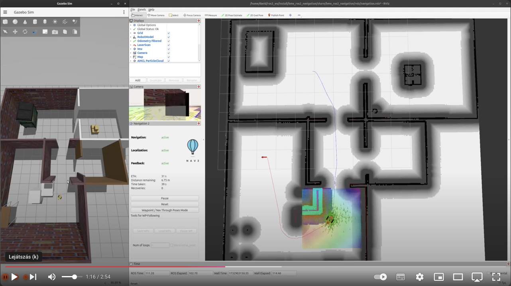
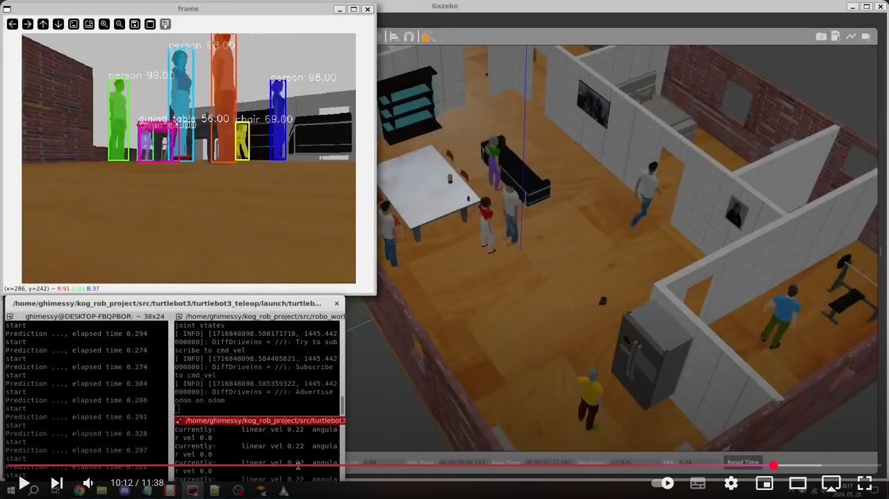

[//]: # (Image References)

[image1]: ./assets/robots.png "Robots"
[image2]: ./assets/terminator.png "Terminator"
[image3]: ./assets/windows-terminal.png "Terminal"
[image4]: ./assets/rqt_graph_1.png "rqt_graph"
[image5]: ./assets/rqt_1.png "rqt"
[image6]: ./assets/turtlesim_1.png "turtlesim"
[image7]: ./assets/rqt_graph_2.png "rqt_graph"
[image8]: ./assets/rqt_2.png "rqt"
[image9]: ./assets/rqt_graph_3.png "rqt_graph"
[image10]: ./assets/rqt_graph_4.png "rqt_graph"
[image11]: ./assets/rqt_graph_5.png "rqt_graph"
[image12]: ./assets/rqt_graph_6.png "rqt_graph"
[image13]: ./assets/rqt_3.png "rqt"
[image14]: ./assets/turtlesim_2.png "turtlesim"
[image15]: ./assets/turtlesim_3.png "turtlesim"
[image16]: ./assets/robots.png "robots"

# Week 1-2: Introduction to ROS2

## This is how far we will get by the end of this course: 

### In the first half of the course we'll learn how to simulate mobile robots, sensors, actuators. How to do mapping localization and navigation.

  <a href="https://youtu.be/NkOX4zX9XbQ"></a>  

### In the second half of the course we'll learn about the simulation of robotic arms with direct and inverse kinematics.

  <a href="https://www.youtube.com/watch?v=AK4aVfQVkVA"></a>  
  <a href="https://www.youtube.com/watch?v=mm2vKYH-Jy8"></a>  

### Here you can see a short video about the final projects from the previous years:

<a href="https://youtu.be/opmUsI7y6Y8"></a>

## Requirements for completing the course:

Detailed description and requirements of the final project can be found on this [link](https://docs.google.com/spreadsheets/d/1gMaBODfGlU8p0b80DhkFaF4C9gJfaIIUKGdBXtmJcQI/edit?usp=sharing). 

### Short summary:
Registration deadline for projects: **week 4**  
Submission deadline: **week 14**
   - Project teams should consist of 3, maximum 4 members.
   - The project submission will take place live (on Teams) in 15+5 minutes
   - The project documentation should be in Markdown format on GitHub (no PPT required!)

### Available real robots at the department:

![alt text][image16]

# Table of Contents
1. [What is ROS(2)?](#what-is-ros2)
2. [Required softwares](#required-softwares)
3. [Basics of ROS2](#basics-of-ros2)  
3.1. [Running some examples](#running-some-examples)  
3.2. [Create a colcon workspace](#create-a-colcon-workspace)  
3.3. [Let's write the simplest possible `hello_world` in python](#lets-write-the-simplest-possible-hello_world-in-python)  
3.4. [Create a python publisher](#create-a-python-publisher)  
3.5. [Create a C++ publisher](#create-a-c-publisher)  
3.6. [Create a python subscriber](#create-a-python-subscriber)  
3.7. [Create a C++ subscriber](#create-a-c-subscriber)  
3.8. [Launchfiles](#launchfiles)  
3.9. [Remap](#remap)  
4. [Parameters](#parameters)  
4.1. [Set the parameter from a launchfile](#set-the-parameter-from-a-launchfile)  
4.2. [A more advanced example for setting parameters](#a-more-advanced-example-for-setting-parameters)  
5. [Services](#services)  
5.1. [Service server](#service-server)  
5.2. [Service client](#service-client)  
5.3. [Use services and parameters with turtlesim](#use-services-and-parameters-with-turtlesim)  
6. [Recap](#recap)  
6.1. [Useful Linux commands](#useful-linux-commands)  
6.2. [Useful ROS2 commands](#useful-ros2-commands)  


# What is ROS(2)?
ROS, or Robot Operating System, is an open-source framework designed to facilitate the development of robotic applications. It provides a collection of tools, libraries, and conventions that simplify the process of designing complex robot behaviors across a wide variety of robotic platforms.

ROS was initially developed in 2007 by the Stanford Artificial Intelligence Laboratory and continued by Willow Garage, with the goal of providing a common platform for research and development in robotics. The primary motivation was to create a standard framework that could support a broad range of robotic applications, promote code reuse, and foster collaboration within the robotics community.

Key reasons for ROS development include:

- **Standardization**: Creating a common platform that simplifies the integration of different hardware and software components.
- **Modularity**: Enabling the development of modular and reusable software components (nodes) that can be easily shared and adapted for various robotic systems.
- **Community Collaboration**: Encouraging collaboration among researchers and developers, resulting in a vast collection of tools and libraries.

### Transition to ROS 2

ROS 2 was developed to address the limitations of ROS 1 and meet the growing demands for industrial and commercial robotics applications. The development began around 2014 and aimed to enhance the capabilities of ROS, particularly in areas such as security, real-time performance, and support for multi-robot systems. In practice, the biggest difference is in the underlying middleware, ROS1 uses a custom transport layer and message-passing system that was not designed for real-time or distributed applications (see ROS1's [`roscore`](http://wiki.ros.org/roscore)).

The latest ROS1 release is ROS Noetic which was intended to be used on Ubuntu 20.04. It goes to [EOL in May, 2025](http://wiki.ros.org/Distributions) together with Ubuntu 20.04.

# Required softwares

<details>
<summary>Ubuntu 24.04 LTS</summary>

<br>In the course we'll use ROS2 [Jazzy Jalisco](https://docs.ros.org/en/jazzy/index.html), which requires Ubuntu 24.04 for the smoothest operation.

You have a couple of options, but the most recommended is the native installation of the operating system - external SSD, dual boot, etc.

1) Native install, the most recommended way. You will learn how to set up the environment, there won't be difficulties with GPU acceleration and many more advantages.
2) Windows 11 WSL2 (Windows Subsystem Linux), see [instructions](https://documentation.ubuntu.com/wsl/en/latest/guides/install-ubuntu-wsl2/). It's a straightforward way if you want to use within Windows environment. You can still learn how to set up the environment but can be more challenging with GUI applications and 3D acceleration.
3) Virtual machine, VMware fusion is [now free for personal use](https://blogs.vmware.com/teamfusion/2024/05/fusion-pro-now-available-free-for-personal-use.html). Less flexible than WSL2 on Windows 11 but works well on macOS. 3D acceleration can be challenging.
4) Docker container. First it might look an easy way to use any ROS distribution on any host operating system, but it's getting more and more challenging if we need GUI applications, 3D acceleration and can be confusing for beginners how to work within the container. You might miss some important experience with setting up the environment if using a pre-configured container image. I only recommend this way for experienced Docker users.
5) Using an online environment e.g. [The Construct](https://www.theconstruct.ai). It looks promising that you don't have to install any special software, but you won't gain experience with setting up the environment. It can be difficult to cherry pick the software versions you need and accessing GUI applications through the web interface is a poor experience.

The options 1 and 2 are the most practical and preferred ways to use ROS. In an exotic case, if you want to run Ubuntu 24.04 and ROS2 Jazzy on macOS and Apple silicon [this](https://www.youtube.com/watch?v=kDosGTdwqO0) is a very good tutorial.

>Pro tip if you want to mount directories from your host system into your guest Ubuntu 24.04 running in VMware fusion, more details [on this link](https://www.liquidweb.com/blog/create-vmware-shared-folder/):
>```bash
>/usr/bin/vmhgfs-fuse .host:/BME/ROS2-lessons /home/david/ros2_ws/src/ROS2-lessons -o subtype=vmhgfs-fuse,allow_other
>```
</details>

<details>
<summary>Visual Studio Code</summary>

<br>The recommended code editor during the course is [Visual Studio Code](https://code.visualstudio.com/docs/setup/setup-overview), but it's up to your choice if you want to go with your different editor. Depending on your Ubuntu install method you might install it natively on Ubuntu, in your virtual environment or on your host operating system.

Recommended extensions to install:
- Markdown All in One
- C/C++
- Python
- CMake Tools
- Remote - SSH - if you work on physical robots, too
- Remote - WSL - if you do the course using WSL2
</details>

<details>
<summary>GitHub and a git client</summary>

<br>The course materials are available on GitHub, and the submissions of your final projects shall also use GitHub. *You'll need a very good excuse why to use alternative git solutions like GitLab.*

So I encourage everyone to [register your GitHub accounts](https://github.com/home), and if you are there don't forget to [sign up for the GitHub Student Developer Pack](https://education.github.com/pack) which gives you a bunch of powerful developer tools for free.

I recommend to use a graphical git client that can boost your experience with git, in my optinion the best one is [GitKraken](https://www.gitkraken.com), which is not a free software, but you get the pro version as part of the GitHub Student Developr Pack! If you prefer using git as a *cli* tool then no worries, it's absoluetely all right.

</details>

<details>
<summary>Markdown</summary>

<br>Markdown is not a standalone software but rather a lightweight, plain-text formatting language used to create formatted documents. It was created by John Gruber in 2004 with the goal of being easy to read and write, using simple syntax to style text, create lists, links, images, and more. It is widely used for writing documentation, readme files, and content for static websites.

Basic Markdown Syntax

- Headings: `#` Heading 1, `##` Heading 2, etc.
- Bold: `**bold text**` or `__bold text__`
- Italic: `*italic text*` or `_italic text_`
- Lists:
    - Unordered: `- Item` or `* Item`
	- Ordered: `1. Item`
	- Links: `[Link text](URL)`
	- Images: ``
	- Code: Inline code or code blocks using triple backticks (```)

GitHub Flavored Markdown (GFM)

GitHub Flavored Markdown (GFM) is a variant of Markdown used by GitHub to provide additional features and syntax that are not available in standard Markdown. It includes:

- Tables:
    ```
    | Column 1 | Column 2 |
    |----------|----------|
    | Row 1    | Data     |
    | Row 2    | Data     |
    ```
- Task lists:
    ```
    - [x] Task 1
    - [ ] Task 2
    ```
- Strikethrough: `~~strikethrough text~~`
- Syntax highlighting in a specific language:
    ```
    ```python
    def hello_world():
    print("Hello, world!")
    ```
- Tables of Contents
- @mentions for users, references to issues, and pull requests using #number

Most of the tips and tricks that you might need for your own project documentation can be found [in the source of this readme](https://github.com/MOGI-ROS/Week-1-2-Introduction-to-ROS2/blob/main/README.md?plain=1) that you read right now, feel free to use any snippets from it!

</details>

<details>
<summary>A good terminal</summary>

<br>It's up to your choice which terminal tool would you like to use, but I strongly recommend one that support multiple split windows in a single unified window, because we will use a **lot of** terminals! On Linux, I can recommend  `terminator`:
![alt text][image2]

In case you use WSL2, the built-in Windows terminal also support multiple panes and works really well!
![alt text][image3]

</details>

<details>
<summary>And finally, install ROS2 Jazzy</summary>

<br>ROS always had very good and detailed installed guides, it's not anything different for ROS2's Jazzy release.
The installation steps can be found [here](https://docs.ros.org/en/jazzy/Installation/Ubuntu-Install-Debs.html), with Ubuntu 24.04 it can be installed simply through pre-built, binary `deb` packages.

After installing it we have to set up our ROS2 environment with the following command:
```bash
source /opt/ros/jazzy/setup.bash
```

By default, we have to run this command in every new shell session we start, but there is a powerful tool in Linux for such use cases. `.bashrc` file is always in the user's home directory and it is used for user-specific settings for our shell sessions. You can edit `.bashrc` directly in a terminal window with a basic text editor, like `nano`:

```bash
david@david-ubuntu24:~$ nano .bashrc
```

Here, you can add your custom user-specific settings in the end of the file, that will be executed every time you initiate a new shell session.
I created an [example gist](https://gist.github.com/dudasdavid/bb2366e2a68bf1401ed692e41fed04d8) that you can add to the end of your file and use it during the course.

ROS2 Jazzy has [an even more detailed tutorial](https://docs.ros.org/en/jazzy/Tutorials/Beginner-CLI-Tools/Configuring-ROS2-Environment.html) about setting up your environment, you can check it out, too!

> If you run into the following error that your GPG keys expired:
> ```bash
> W: An error occurred during the signature verification. The repository is not updated and the previous index files will be used. GPG error: http://packages.ros.org/ros2/ubuntu noble InRelease: The following signatures were invalid: EXPKEYSIG F42ED6FBAB17C654 Open Robotics <info@osrfoundation.org>
> ```
> You can fix it by updating your keys:
> ```
> sudo curl -sSL https://raw.githubusercontent.com/ros/rosdistro/master/ros.key -o /usr/share/keyrings/ros-archive-keyring.gpg
> ```

</details>

# Basics of ROS2

## Running some examples

Your ROS2 install comes with a couple of good examples as you can also find it [on the install page](https://docs.ros.org/en/jazzy/Installation/Ubuntu-Install-Debs.html#try-some-examples).

Let's try them!

The following command starts a simple `publisher` written in C++. A `publisher` is a node that is responsible for sending messages with a certain type over a specific `topic` (in this example the topic's name is `chatter` and the type is a string). A `topic` is a communication pipeline in the publish-subscribe communication model where a single message is sent to multiple subscribers, unlike message-queues that are point-to-point models, where a single message is sent to a single consumer. Publishers broadcast messages to topics, and subscribers listen to those topics to receive a copy of the message.

> Publish-subscribe models are asynchronous, one-to-many or many-to-many interactions where the publishers don't know how many subscribers there are (if any). Therefore publisher never expects any response or confirmation from the subscribers.

Now, let's run the demo publisher written in C++:

```bash
ros2 run demo_nodes_cpp talker
```

Your output should look like this:
```bash
david@david-ubuntu24:~$ ros2 run demo_nodes_cpp talker
[INFO] [1727116062.558281395] [talker]: Publishing: 'Hello World: 1'
[INFO] [1727116063.558177802] [talker]: Publishing: 'Hello World: 2'
[INFO] [1727116064.558010534] [talker]: Publishing: 'Hello World: 3'
[INFO] [1727116065.557939861] [talker]: Publishing: 'Hello World: 4'
[INFO] [1727116066.557849645] [talker]: Publishing: 'Hello World: 5'
```

Let's start a subscriber - written in Python - in another terminal window, which subscribes to the `chatter` topic and listens to the publisher node's messages:

```bash
david@david-ubuntu24:~$ ros2 run demo_nodes_py listener
[INFO] [1727116231.574662048] [listener]: I heard: [Hello World: 170]
[INFO] [1727116232.560517676] [listener]: I heard: [Hello World: 171]
[INFO] [1727116233.558907367] [listener]: I heard: [Hello World: 172]
[INFO] [1727116234.560768278] [listener]: I heard: [Hello World: 173]
[INFO] [1727116235.559821377] [listener]: I heard: [Hello World: 174]
[INFO] [1727116236.559993767] [listener]: I heard: [Hello World: 175]
```

### Useful cli and graphical tools
Now both nodes are running we can try a few useful tools. The first on let us know what kind of nodes are running in your ROS2 system:

```bash
ros2 node list
```

Which gives us the following output:
```bash
david@david-ubuntu24:~/ros2_ws$ ros2 node list
/listener
/talker
```

If we want to know more about one of our nodes, we can use the `ros2 node info /node` command:
```bash
david@david-ubuntu24:~/ros2_ws$ ros2 node info /listener 
/listener
  Subscribers:
    /chatter: std_msgs/msg/String
  Publishers:
    /parameter_events: rcl_interfaces/msg/ParameterEvent
    /rosout: rcl_interfaces/msg/Log
  Service Servers:
    /listener/describe_parameters: rcl_interfaces/srv/DescribeParameters
    /listener/get_parameter_types: rcl_interfaces/srv/GetParameterTypes
    /listener/get_parameters: rcl_interfaces/srv/GetParameters
    /listener/get_type_description: type_description_interfaces/srv/GetTypeDescription
    /listener/list_parameters: rcl_interfaces/srv/ListParameters
    /listener/set_parameters: rcl_interfaces/srv/SetParameters
    /listener/set_parameters_atomically: rcl_interfaces/srv/SetParametersAtomically
  Service Clients:

  Action Servers:

  Action Clients:
```

At the moment, the most interesting detail we can gather about a node is if it's subscribing or publishing to any topic. In later lessons we'll learn more about parameters and services.

---

In a very similar way, we can also list all of our topics with `ros2 topic list` command:
```bash
david@david-ubuntu24:~/ros2_ws$ ros2 topic list 
/chatter
/parameter_events
/rosout
```

And we can get more details about a certain topic with the `ros2 topic info /topic` command:
```bash
david@david-ubuntu24:~/ros2_ws$ ros2 topic info /chatter 
Type: std_msgs/msg/String
Publisher count: 1
Subscription count: 1
```

Another powerful tool is `rqt_graph` that helps us visualizing the nodes and topics in a graph.
![alt text][image4]

`rqt_graph` can be used as a standalone tool, or part of `rqt` which can be used to build a complete dashboard to mintor and control your nodes. We'll spend a lot of time with it, at the moment let's just see the message monitoring function:
![alt text][image5]

---

### Let's run more examples: turtlesim
Let's see another built in example which is a simple 2D plotter game.
> In a case it's not automatically installed, you can install it with the following command:
> ```bash
> sudo apt install ros-jazzy-turtlesim
> ```

To run the main node just execute the follwoing command:
```bash
ros2 run turtlesim turtlesim_node
```

And in another terminal start its remote controller, you can simply drive the turtle with the arrows:
```bash
ros2 run turtlesim turtle_teleop_key
```
![alt text][image6]

We can use the same tools as before to see the running nodes and topics, here is how does it look like in `rqt_graph`.
![alt text][image7]

>We should notice two important things:
>
>1. turtlesim is more complex than the previous example with multiple services and parameters that we'll check in the end of this lesson.
>2. the turtle is controlled with a `cmd_vel` message which is a 6D vector in space. We'll use this exact same message type in the future to drive our simulated robots.

Now let's move on to create our own nodes!

## Create a colcon workspace

To create, build and run custom nodes we need packages, but first we need a workspace where we'll maintain our future packages.
There are 2 new terms we must learn about ROS2 workspaces:

1. `ament` provides the underlying build system and tools specifically for ROS2 packages. `ament_cmake` is a CMake-based build system for C/C++ nodes and `ament_python` provides the tools for packing and installing python nodes and libraries.
2. `colcon` (COmmand Line COLlectioN) is a general-purpose tool to build and manage entire workspaces with various build systems, including ament, cmake, make, and more. 

It means that our ROS2 workspace will be a `colcon workspace` which - in the backround - will use `ament` for building the individual packages.

>If you have experience with ROS1, `colcon` and `ament` replaces the old `catkin` tools.

Let's create our workspace inside our user's home directory:
```bash
mkdir -p ~/ros2_ws/src
cd ~/ros2_ws
```

>A workspace must have a `src` folder where we maintain the source files of our packages, during building of the workspace colcon will create folders for the deployment of binaries and other output files.

Let's go into the `src` folder and create our first python package:
```bash
ros2 pkg create --build-type ament_python bme_ros2_tutorials_py
```
> During package creation we should define if it's a C/C++ (`ament_cmake`) or a python (`ament_python`) package. If we don't do it, the default is always `ament_cmake`!

We'll put our python scripts under `bme_ros2_tutorials_py` which is an automatically created folder with the same name as our package, it already has an empty file `__init__.py`, let's add our first node here: `hello_world.py`.

>We can create files in Linux in several different ways, just a few examples:
> - Right click in the folder using the desktop environment
> - Through the development environment, in our case Visual Studio Code
> - From command line in the current folder using the `touch` command: `touch hello_world.py`

At this point our workspace should look like this (other files and folders are not important at this point):
```bash
david@david-ubuntu24:~/ros2_ws$ tree -L 4
.
└── src
    └── bme_ros2_tutorials_py
        ├── bme_ros2_tutorials_py
        │   ├── __init__.py
        │   └── hello_world.py
        ├── package.xml
        └── setup.py
```

> It's always recommended to fill the `description`, `maintainer` with your name and email address and `license` fields in your `package.xml` and `setup.py` files. I personally prefer a highly permissive license in non-commercial packages of mine, like `BSD` or `Apache License 2.0`.

## Let's write the simplest possible `hello_world` in python:

```python
#!/usr/bin/env python3

# Main entry point, args is a parameter that is used to pass arguments to the main function
def main(args=None):
    print("Hello, world!")

# Check if the script is being run directly
if __name__ == '__main__':
    main()
```

Although this is a python script that doesn't require any compilation, we have to make sure that `ament` will pack, copy and install our node. It's important to understand that we are not running python scripts directly from the source folder!

Let's edit `setup.py` that was automatically generated when we defined that our package will use `ament_python`.

Add an entry point for our python node. An entry point describes the folder, the filename (without `.py`) and the main entry point within the script:

```python
...
        entry_points={
            'console_scripts': [
                'py_hello_world = bme_ros2_tutorials_py.hello_world:main'
            ],
        },
...
```

Our first node within our first package is ready for building it! Build must be initiated always in the root of our workspace!

```bash
cd ~/ros2_ws
```

And here we execute the `colcon build` command.

After a successful build we have to update our environnment to make sure ROS2 cli tools are aware about of any new packages. To do this we have to run the following command:
```bash
source install/setup.bash
```

As we did with the base ROS2 environment, we can add this to the `.bashrc` so it'll be automatically sourced every time when we open a terminal:
```bash
source ~/ros2_ws/install/setup.bash
```

And now we are ready to run our first node:
```bash
ros2 run bme_ros2_tutorials_py py_hello_world
```

Athough we could run our first node, it was just a plain python script, not using any ROS API. Let's upgrade hello world to a more *ROS-like* hello world. We import the `rclpy` which is the ROS2 python API and we start using the most basic functions of `rclpy` like `init()`, `create_node()` and `shutdown()`. If you already want to do a deep-dive in the API functions you can find everything [here](https://docs.ros.org/en/jazzy/Concepts/Basic/About-Client-Libraries.html#the-rclpy-package).

```python
#!/usr/bin/env python3
import rclpy # Import ROS2 python interface

# Main entry point, args is a parameter that is used to pass arguments to the main function
def main(args=None):
    rclpy.init(args=args)                          # Initialize the ROS2 python interface
    node = rclpy.create_node('python_hello_world') # Node constructor, give it a name
    node.get_logger().info("Hello, ROS2!")         # Use the ROS2 node's built in logger
    node.destroy_node()                            # Node destructor
    rclpy.shutdown()                               # Shut the ROS2 python interface down

# Check if the script is being run directly
if __name__ == '__main__':
    main()
```

We don't have to do anything with `setup.py`, the entrypoint is already there, but we have to re-build the colcon workspace!

After the build we can run our node:
```bash
ros2 run bme_ros2_tutorials_py py_hello_world
```

## Create a python publisher

Let's make our first publisher in python, we create a new file in the `bme_ros2_tutorials_py` folder: `publisher.py`.

We start expanding step-by-step our knowledge about the ROS2 API with publishing related functions (`create_publisher()` and `publish()`).

```python
#!/usr/bin/env python3
import rclpy
from std_msgs.msg import String # Import 'String' from ROS2 standard messages
import time

def main(args=None):
    rclpy.init(args=args)
    node = rclpy.create_node('python_publisher')
    # Register the node as publisher
    # It will publish 'String' type to the topic named 'topic' (with a queue size of 10)
    publisher = node.create_publisher(String, 'topic', 10)

    msg = String()                     # Initialize msg as a 'String' instance
    i = 0
    while rclpy.ok():                  # Breaks the loop on ctrl+c
        msg.data = f'Hello, world: {i}' # Write the actual string into msg's data field
        i += 1
        node.get_logger().info(f'Publishing: "{msg.data}"')
        publisher.publish(msg)         # Let the node publish the msg according to the publisher setup
        time.sleep(0.5)                # Python wait function in seconds

    node.destroy_node()
    rclpy.shutdown()

if __name__ == '__main__':
    main()
```

We have to edit `setup.py`, registering our new node as entry point:
```python
...
    entry_points={
        'console_scripts': [
            'py_hello_world = bme_ros2_tutorials_py.hello_world:main',
            'py_publisher = bme_ros2_tutorials_py.publisher:main'
        ],
    },
...
```

Don't forget to rebuild the workspace and we can run our new node:

```bash
david@david-ubuntu24:~$ ros2 run bme_ros2_tutorials_py py_publisher
[INFO] [1727526317.470055907] [python_publisher]: Publishing: "Hello, world: 0"
[INFO] [1727526317.971461827] [python_publisher]: Publishing: "Hello, world: 1"
[INFO] [1727526318.473896872] [python_publisher]: Publishing: "Hello, world: 2"
[INFO] [1727526318.977439178] [python_publisher]: Publishing: "Hello, world: 3"
```

We can observe the published topic through `rqt`'s topic monitor:
![alt text][image8]

Or we can use a simple but powerful tool, the `topic echo`:
```bash
david@david-ubuntu24:~$ ros2 topic echo /topic 
data: 'Hello, world: 23'
---
data: 'Hello, world: 24'
---
data: 'Hello, world: 25'
```

The publisher node above is very simple and looks exactly how we historically impelented nodes in ROS1. But ROS2 provides more powerful API functions and also places a greater emphasis on object-oriented programming. So let's create another publisher in a more OOP way and using the timer functions (`create_timer()`) of the ROS2 API. The other important API function is `rclpy.spin(node)` which keeps the node running until we don't quit it with `ctrl+c` in the terminal.

```python
#!/usr/bin/env python3
import rclpy
from rclpy.node import Node     # Import ROS2 Node as parent for our own node class
from std_msgs.msg import String

class MyPublisherNode(Node):
    def __init__(self):
        super().__init__("python_publisher_oop")
        self.publisher_ = self.create_publisher(String, 'topic', 10)
        self.timer = self.create_timer(0.5, self.timer_callback)     # Timer callback, period in seconds, not frequency!
        self.i = 0
        self.msg = String()
        self.get_logger().info("Publisher OOP has been started.")

    def timer_callback(self):                                        # Timer callback function implementation
        self.msg.data = f"Hello, world: {self.i}"
        self.i += 1
        self.get_logger().info(f'Publishing: "{self.msg.data}"')
        self.publisher_.publish(self.msg)

def main(args=None):
    rclpy.init(args=args)
    node = MyPublisherNode() # node is now a custom class based on ROS2 Node
    rclpy.spin(node)         # Keeps the node running until it's closed with ctrl+c
    node.destroy_node()
    rclpy.shutdown()

if __name__ == "__main__":
    main()
```

As we did previously, add the new script's entrypoint in the `setup.py`, build the workspace and run our new node:
```bash
ros2 run bme_ros2_tutorials_py py_publisher_oop
```

## Create a C++ publisher

In ROS1 it was very straightforward to mix nodes written in different languages. In ROS2, although it's not impossible, it requires more manual editing of package metadata because we define in advance for `ament` what is the package's build type. To keep it simple now, let's create a new package:

```bash
ros2 pkg create --build-type ament_cmake bme_ros2_tutorials_cpp
```

> [On this link](https://roboticsbackend.com/ros2-package-for-both-python-and-cpp-nodes/), you can see an example how to mix both python and C++ nodes within the same package.

Let's create `publisher.cpp` in `src` folder of the new package, this follows the object-oriented patterns as our previous python node, including the ROS2 timer. This time we work with [the ROS2 C++ API](https://docs.ros.org/en/jazzy/Concepts/Basic/About-Client-Libraries.html#the-rclcpp-package), `rclcpp`, the available API functions are pretty much identical to the `rclpy`.

```cpp
#include "rclcpp/rclcpp.hpp"
#include "std_msgs/msg/string.hpp"

class MyPublisherNode : public rclcpp::Node
{
public:
    MyPublisherNode() : Node("cpp_publisher"), count_(0)
    {
        publisher_ = this->create_publisher<std_msgs::msg::String>("topic", 10);
        timer_     = this->create_wall_timer(std::chrono::milliseconds(500),
                                                std::bind(&MyPublisherNode::publishString, this));
        RCLCPP_INFO(this->get_logger(), "CPP publisher has been started.");
    }

private:
    void publishString()
    {
        auto msg = std_msgs::msg::String();
        msg.data = "Hello, world: " + std::to_string(this->count_++);
        RCLCPP_INFO(this->get_logger(), "Publishing: '%s'", msg.data.c_str());
        publisher_->publish(msg);
    }

    size_t count_;
    rclcpp::Publisher<std_msgs::msg::String>::SharedPtr publisher_;
    rclcpp::TimerBase::SharedPtr timer_;
};

int main(int argc, char **argv)
{
    rclcpp::init(argc, argv);
    rclcpp::spin(std::make_shared<MyPublisherNode>());
    rclcpp::shutdown();
    return 0;
}
```

To properly set up our node in the package's metadata files we have to edit the `CMakeLists.txt`:
```cmake
find_package(rclcpp REQUIRED)
find_package(std_msgs REQUIRED)

add_executable(publisher_cpp src/publisher.cpp)
ament_target_dependencies(publisher_cpp rclcpp std_msgs)

install(TARGETS
  publisher_cpp
  DESTINATION lib/${PROJECT_NAME})
```

After that we can build the workspace with `colcon build`, since it's a new package we have to source the environment and after the we can run our new node:
```bash
ros2 run bme_ros2_tutorials_cpp publisher_cpp
```

> If sourcing the environment of your workspace is already in the `.bashrc` it's just easier to close and open a new terminal session.

We can use the same tools as before to observe the published data by our new C++ node like `topic list`, `topic echo` or a graphical tool like `rqt`.

## Create a python subscriber

Let's create a new file `subscriber.py` in our python package (`bme_ros2_tutorials_py`). First we make a very simple implementation and after that we'll implement a more OOP version of it again. We further extend our knowledge with more API functions related to subscriptions (`create_subscription()`).

```python
#!/usr/bin/env python3
import rclpy
from std_msgs.msg import String


def main(args=None):
    rclpy.init(args=args)
    node = rclpy.create_node('python_subscriber')

    def subscriber_callback(msg):                      # Subscriber callback will be invoked every time when a message arrives to the topic it has subsctibed
        node.get_logger().info(f"I heard: {msg.data}")

    # Register the node as a subscriber on a certain topic: 'topic' (with a certain data type: String)
    # and assign the callback function that will be invoked when a message arrives to the topic
    # with a queue size of 10 which determines how many incoming messages can be held in the subscriber’s
    # queue while waiting to be processed by the callback function
    subscriber = node.create_subscription(String, 'topic', subscriber_callback, 10) 
    node.get_logger().info("Subsciber has been started.")

    rclpy.spin(node)

    node.destroy_node()
    rclpy.shutdown()


if __name__ == '__main__':
    main()
```

Add the node to the `setup.py` file as a new entry point

```python
...
    entry_points={
        'console_scripts': [
            'py_hello_world = bme_ros2_tutorials_py.hello_world:main',
            'py_publisher = bme_ros2_tutorials_py.publisher:main',
            'py_publisher_oop = bme_ros2_tutorials_py.publisher_oop:main',
            'py_subscriber = bme_ros2_tutorials_py.subscriber:main'
        ],
    },
...
```

Then, build the workspace and we can run our new node!

```bash
david@david-ubuntu24:~$ ros2 run bme_ros2_tutorials_py py_subscriber
[INFO] [1727606328.416973729] [python_subscriber]: Subsciber has been started.
```

If we don't start a publisher, then our subscriber is just keep listening to the `/topic` but the callback function is not invoked. The node doesn't stop running because of the `rclpy.spin(node)`  function.

Let's start our C++ publisher in another terminal:
```bash
david@david-ubuntu24:~$ ros2 run bme_ros2_tutorials_cpp publisher_cpp 
[INFO] [1727606744.184678739] [cpp_publisher]: CPP publisher has been started.
[INFO] [1727606744.685934650] [cpp_publisher]: Publishing: 'Hello, world: 0'
[INFO] [1727606745.185073828] [cpp_publisher]: Publishing: 'Hello, world: 1'
[INFO] [1727606745.686288921] [cpp_publisher]: Publishing: 'Hello, world: 2'
[INFO] [1727606746.186169881] [cpp_publisher]: Publishing: 'Hello, world: 3'
```

And let's see what happens with the subscriber! It's subscription callback function is invoked every time when the publisher sends a message onto the `/topic`.
```bash
david@david-ubuntu24:~/ros2_ws$ ros2 run bme_ros2_tutorials_py py_subscriber
[INFO] [1727606614.099180007] [python_subscriber]: Subsciber has been started.
[INFO] [1727606744.695260304] [python_subscriber]: I heard: Hello, world: 0
[INFO] [1727606745.187956805] [python_subscriber]: I heard: Hello, world: 1
[INFO] [1727606745.689289484] [python_subscriber]: I heard: Hello, world: 2
[INFO] [1727606746.188467429] [python_subscriber]: I heard: Hello, world: 3
```

We can also check it with `rqt_graph`:
![alt text][image9]

> And we can also observe the language agnostic approach of ROS2, without any additional effort this middleware provides interfacing between nodes written in different programming languages.

As before, let's make our subscriber more OOP using our previous template from the publisher. Compared to the publisher we just need to replace the timer callback with a subscription callback and that's all!
```python
#!/usr/bin/env python3
import rclpy
from rclpy.node import Node
from std_msgs.msg import String

class MySubscriberNode(Node):
    def __init__(self):
        super().__init__("python_subsciber_oop")
        self.subscriber_ = self.create_subscription(String, 'topic', self.subscriber_callback, 10)
        self.get_logger().info("Subsciber OOP has been started.")

    def subscriber_callback(self, msg):
        self.get_logger().info(f"I heard: {msg.data}")

def main(args=None):
    rclpy.init(args=args)
    node = MySubscriberNode()
    rclpy.spin(node)
    node.destroy_node()
    rclpy.shutdown()

if __name__ == "__main__":
    main()
```
Build the workspace and run the node.

## Create a C++ subscriber

Now let's create a new file in the `src` directory of the `bme_ros2_tutorials_cpp`, we can name it `subscriber.cpp`.

```cpp
#include "rclcpp/rclcpp.hpp"
#include "std_msgs/msg/string.hpp"

class MySubscriberNode : public rclcpp::Node
{
public:
    MySubscriberNode() : Node("cpp_subscriber")
    {
        subscriber_ = this->create_subscription<std_msgs::msg::String>(
            "topic", 10, std::bind(&MySubscriberNode::subscriber_callback, this, std::placeholders::_1));
    }

private:
    void subscriber_callback(const std_msgs::msg::String & msg) const
    {
        RCLCPP_INFO(this->get_logger(), "I heard: '%s'", msg.data.c_str());
    }

    rclcpp::Subscription<std_msgs::msg::String>::SharedPtr subscriber_;
};

int main(int argc, char **argv)
{
    rclcpp::init(argc, argv);
    auto node = std::make_shared<MySubscriberNode>();
    rclcpp::spin(node);
    rclcpp::shutdown();
    return 0;
}
```
Add it to the `CMakeLists.txt`:
```cmake
add_executable(publisher_cpp src/publisher.cpp)
add_executable(subscriber_cpp src/subscriber.cpp)
ament_target_dependencies(publisher_cpp rclcpp std_msgs)
ament_target_dependencies(subscriber_cpp rclcpp std_msgs)

install(TARGETS
  publisher_cpp
  subscriber_cpp
  DESTINATION lib/${PROJECT_NAME})
```

Build the workspace and we can try the new node. Let's start also a publisher and observe the behavior of the new C++ subscriber with the tools we already know!

## Launchfiles

As you noticed with the previous examples we have to use as many terminals as many nodes we start. With a simple publisher and subscriber this isn't really a big deal, but in more complex robotic projects, it's quite common to use ROS nodes in the range of tens or even hundreds. Therefore ROS provides an efficient interface to start multiple nodes together and even re-map their topics to different ones or change its parameters instead of changing the source code itself. 

Compared to ROS1 it's a bit more complicated to bundle these launchfiles with our nodes, so as a best practice, I recommend creating an individual pakage only for our launcfiles.

Let's create a new package with `ament_cmake` or simply without specifying the build type (by default it's `ament_cmake`).

```bash
ros2 pkg create bme_ros2_tutorials_bringup
```

Now let's create a `launch` folder within this new package.
We can freely delete include and src folders:

> If you want to delete a folder from command line that is not empty you can use the `rm -rf folder` command

```bash
rm -rf include/ src/
```

Add the following to the `CMakeLists.txt` to install the content of `launch` when we build the workspce:
```bash
install(DIRECTORY
  launch
  DESTINATION share/${PROJECT_NAME}
)
```

Create a new launch file, and let's call it `publisher_subscriber.launch.py`. In ROS2 the launchfiles are special declarative python scripts (with some imperative flavours) instead of the `xml` files we used in ROS1! Actually ROS2 also has the possibility to use `xml` based launch files, but the general usage and the documentation of this feature is very poor. Initially the python based launch system was intended to be the backend of xml launchfiles but it wasn't ready for the initial launch of ROS2 and the community rather jumped on using the python launch system.
```bash
touch publisher_subscriber.launch.py
```

Let's create our template that we can re-use in the future with only one publisher first. When we add a node to the launch file we must define the the `package`, the `node` (executable) and a freely chosen `name`.
```python
#!/usr/bin/env python3
from launch import LaunchDescription
from launch_ros.actions import Node

def generate_launch_description():
    ld = LaunchDescription()

    publisher_node = Node(
        package="bme_ros2_tutorials_py",
        executable="py_publisher",
        name="my_publisher"
    )

    ld.add_action(publisher_node)
    return ld
```

Build and don't forget to source the workspace because we added a new package!

After it we can execute our launchfile with the `ros2 launch` command:
```bash
david@david-ubuntu24:~$ ros2 launch bme_ros2_tutorials_bringup publisher_subscriber.launch.py
[INFO] [launch]: All log files can be found below /home/david/.ros/log/2024-09-29-14-17-29-864407-david-ubuntu24-41228
[INFO] [launch]: Default logging verbosity is set to INFO
[INFO] [py_publisher-1]: process started with pid [41231]
[py_publisher-1] [INFO] [1727612250.056173684] [my_publisher]: Publishing: "Hello, world: 0"
[py_publisher-1] [INFO] [1727612250.559170990] [my_publisher]: Publishing: "Hello, world: 1"
[py_publisher-1] [INFO] [1727612251.061618736] [my_publisher]: Publishing: "Hello, world: 2"
```

> If we don't write the *`launch`* word explicitly in the filename of our launch file, the `ros2 launch` cli tool won't be able to autocomplete the filenames.

We can notice that our node is now called `my_publisher` instead of `python_publisher` as we coded in the node itself earlier. With the launch files we can easily rename our nodes for better handling and organizing as our application scales up.

We can use the `node list` tool to list our nodes and the output will look like this:
```bash
david@david-ubuntu24:~/ros2_ws$ ros2 node list 
/my_publisher
```

### Now let's add the subscriber too:

Every time when we add a node to the launch file we also have to register it with the `ld.add_action()` function:

```python
from launch import LaunchDescription
from launch_ros.actions import Node

def generate_launch_description():
    ld = LaunchDescription()

    publisher_node = Node(
        package="bme_ros2_tutorials_py",
        executable="py_publisher",
        name="my_publisher",
    )

    subscriber_node = Node(
        package="bme_ros2_tutorials_py",
        executable="py_subscriber",
        name="my_subscriber",
    )

    ld.add_action(publisher_node)
    ld.add_action(subscriber_node)
    return ld
```

Don't forget to rebuild the workspace so the changed launchfile will be installed, after that we can run it!
```bash
david@david-ubuntu24:~$ ros2 launch bme_ros2_tutorials_bringup publisher_subscriber.launch.py
[INFO] [launch]: All log files can be found below /home/david/.ros/log/2024-09-29-14-20-15-603371-david-ubuntu24-41380
[INFO] [launch]: Default logging verbosity is set to INFO
[INFO] [py_publisher-1]: process started with pid [41383]
[INFO] [py_subscriber-2]: process started with pid [41384]
[py_publisher-1] [INFO] [1727612415.811451529] [my_publisher]: Publishing: "Hello, world: 0"
[py_subscriber-2] [INFO] [1727612415.811459737] [my_subscriber]: Subsciber has been started.
[py_subscriber-2] [INFO] [1727612415.811878677] [my_subscriber]: I heard: Hello, world: 0
[py_publisher-1] [INFO] [1727612416.313222973] [my_publisher]: Publishing: "Hello, world: 1"
[py_subscriber-2] [INFO] [1727612416.315340170] [my_subscriber]: I heard: Hello, world: 1
```

We can see that both nodes started and their logging to the standard output is combined in this single terminal window.

We can verify this with `node list` or using `rqt_graph` visually:
```bash
david@david-ubuntu24:~$ ros2 node list 
/my_publisher
/my_subscriber
```

We can also verify the used topics with the `topic list` tool:
```bash
david@david-ubuntu24:~$ ros2 topic list 
/parameter_events
/rosout
/topic
```

## Remap

With the launch files we can not just rename our nodes, we can also *re-map* topics, let's try to remap the existing `/topic` to `/another_topic`:

Let's add remapping to the publisher:
```python
    publisher_node = Node(
        package="bme_ros2_tutorials_py",
        executable="py_publisher",
        name="my_publisher",
        remappings=[
            ("topic", "another_topic")
        ]
    )
```

After build we can run the modified launch file and verify the topics with `topic list`:

```bash
david@david-ubuntu24:~$ ros2 topic list 
/another_topic
/parameter_events
/rosout
/topic

```
Our subsriber's callback function is obviously not triggered because it's still listening to the original `/topic` while the publisher now sends its messages to `/another_topic`, we can see it visually that our two nodes are now unconnected with `rqt_graph`:
![alt text][image10]

We can also use the `node info` cli tool to check what are the published topics and the subscriptions for a specific node:
```bash
ros2 node info /my_publisher
```

### Let's remap our subscriber too!

Add re-mapping in the same way to the subscriber, too:
```python
...
        remappings=[
            ("topic", "another_topic")
        ]
...
```

And we'll see that they are connected again, through the `/another_topic`.
![alt text][image11]


### Adding more nodes
Now let's add more publishers and subscribers, also start mixing our C++ and python nodes:
```python
from launch import LaunchDescription
from launch_ros.actions import Node

def generate_launch_description():
    ld = LaunchDescription()

    cpp_publisher_node = Node(
        package="bme_ros2_tutorials_cpp",
        executable="publisher_cpp",
        name="my_cpp_publisher",
    )

    py_publisher_node = Node(
        package="bme_ros2_tutorials_py",
        executable="py_publisher",
        name="my_py_publisher",
        remappings=[
            ("topic", "another_topic")
        ]
    )

    py_subscriber_node1 = Node(
        package="bme_ros2_tutorials_py",
        executable="py_subscriber",
        name="my_py_subscriber1",
    )

    py_subscriber_node2 = Node(
        package="bme_ros2_tutorials_py",
        executable="py_subscriber_oop",
        name="my_py_subscriber2",
    )

    cpp_subscriber_node1 = Node(
        package="bme_ros2_tutorials_cpp",
        executable="subscriber_cpp",
        name="my_cpp_subscriber1",
        remappings=[
            ("topic", "another_topic")
        ]
    )

    ld.add_action(cpp_publisher_node)
    ld.add_action(py_publisher_node)
    ld.add_action(py_subscriber_node1)
    ld.add_action(py_subscriber_node2)
    ld.add_action(cpp_subscriber_node1)
    return ld
```

Rebuild the workspace and let's see them visually with `rqt_graph`:
![alt text][image12]

# Parameters

ROS2 provides an interface to custom parameters of nodes, we can list the parameters, get or set their value with the `param list`, `param get` and `param set` cli tools.

Let's see what kind of parameters do we have for our existing nodes, start our C++ publisher:
```bash
david@david-ubuntu24:~$ ros2 run bme_ros2_tutorials_cpp publisher_cpp 
```

And in a separate terminal execute `ros2 param list /cpp_publisher`:
```bash
david@david-ubuntu24:~$ ros2 param list /cpp_publisher
  qos_overrides./parameter_events.publisher.depth
  qos_overrides./parameter_events.publisher.durability
  qos_overrides./parameter_events.publisher.history
  qos_overrides./parameter_events.publisher.reliability
  start_type_description_service
  use_sim_time
```

Although this list a couple of parameters, these are default parameters that were set up by the ROS2 C++ API, let's write another python publisher node where this time we add a parameter with the ROS2 API. Let's use our OOP publisher as the template:

```python
#!/usr/bin/env python3
import rclpy
from rclpy.node import Node
from std_msgs.msg import String

class MyPublisherNode(Node):
    def __init__(self):
        super().__init__("python_publisher_with_parameter")
        self.declare_parameter("published_text", "MOGI")        # Add a parameter with a default value
        self.text_ = self.get_parameter("published_text").value # Copy the parameter value into the text_ variable

        self.publisher_ = self.create_publisher(String, 'topic', 10)
        self.timer = self.create_timer(0.5, self.timer_callback)
        self.i = 0
        self.msg = String()
        self.get_logger().info("Publisher OOP has been started.")

    def timer_callback(self):
        self.msg.data = f"{self.text_}: {self.i}"               # use the text_ variable for the String message
        self.i += 1
        self.get_logger().info(f'Publishing: "{self.msg.data}"')
        self.publisher_.publish(self.msg)

def main(args=None):
    rclpy.init(args=args)
    node = MyPublisherNode()
    rclpy.spin(node)
    node.destroy_node()
    rclpy.shutdown()

if __name__ == "__main__":
    main()
```

Now, let's see the parameters with the `param list` tool:
```bash
david@david-ubuntu24:~$ ros2 param list /python_publisher_with_parameter 
  published_text
  start_type_description_service
  use_sim_time
```

The `published_text` parameter is now visible for ROS2.

> Parameter handling is a key difference between ROS1 and ROS2, in ROS1 it was a centralized functionality of the ROS master (`ros_core`), every node reported it's parameters to the global parameter server and we could change their parameters only through this parameter server. In ROS2, there is no parameter server anymore and the handling of parameters is node-specific and decentralized.

Let's see how can we get the value of this parameter using `param get` tool:

```bash
david@david-ubuntu24:~$ ros2 param get /python_publisher_with_parameter published_text
String value is: MOGI
```

Now let's try to modify the parameter value from `MOGI` to `BME`:
```bash
ros2 param set /python_publisher_with_parameter published_text BME
```

As we experience it doesn't work because we set the `self.text_` variable in the constructor, so it's value is not dynamically read from the parameter set by the API.
This is not necessarily a mistake, if we only want to set these parameters at startup instead of changing them runtime. For example setting up a topic's name or the frequency of a timer is often used as startup parameters.

This time we want to dynamically change the text so let's move this line into the `timer_callback()` instead of the constructor:
```python
self.text_ = self.get_parameter("published_text").value
```

Rebuild the workspace, start the node and modify the parameter as before. As we expected we could change the published text runtime through the ROS2 `param` API.
```bash
[INFO] [1727616903.755729829] [python_publisher_with_parameter]: Publishing: "MOGI: 3"
[INFO] [1727616904.254593308] [python_publisher_with_parameter]: Publishing: "MOGI: 4"
[INFO] [1727616904.754490094] [python_publisher_with_parameter]: Publishing: "BME: 5"
[INFO] [1727616905.255873125] [python_publisher_with_parameter]: Publishing: "BME: 6"
```

## Set the parameter from a launchfile

Now, let's create a new launch file (`publisher_param.launch.py`) that starts our latest node with a custom parameter.
```python
#!/usr/bin/env python3
from launch import LaunchDescription
from launch_ros.actions import Node

def generate_launch_description():
    ld = LaunchDescription()

    cpp_publisher_node = Node(
        package="bme_ros2_tutorials_py",
        executable="python_publisher_with_parameter",
        name="my_publisher",
        parameters=[{"published_text": "Parameter_from_launch"}]
    )


    ld.add_action(cpp_publisher_node)
    return ld
```

Rebuild the workspace and launch the file:
```bash
david@david-ubuntu24:~$ ros2 launch bme_ros2_tutorials_bringup publisher_param.launch.py
[INFO] [launch]: All log files can be found below /home/david/.ros/log/2024-09-29-15-50-33-210526-david-ubuntu24-44682
[INFO] [launch]: Default logging verbosity is set to INFO
[INFO] [py_publisher_with_param-1]: process started with pid [44685]
[py_publisher_with_param-1] [INFO] [1727617833.429100542] [my_publisher]: Publisher OOP has been started.
[py_publisher_with_param-1] [INFO] [1727617833.926650915] [my_publisher]: Publishing: "Parameter_from_launch: 0"
[py_publisher_with_param-1] [INFO] [1727617834.426182680] [my_publisher]: Publishing: "Parameter_from_launch: 1"
```


## A more advanced example for setting parameters

Some parameters are usually set in the constructor like a topic's name or the frequency of a publisher. Now let's see a more advanced example for changing the frequency runtime. Using this for changing a period is more a workaround than an API feature. On parameter change we will cancel the existing timer and start another one with the new parameter. Let's upgrade our exisiting node with the changes:

```python
#!/usr/bin/env python3
import rclpy
from rclpy.node import Node
from std_msgs.msg import String
from rcl_interfaces.msg import SetParametersResult

class MyPublisherNode(Node):
    def __init__(self):
        super().__init__("python_publisher_with_parameter")
        self.declare_parameter("published_text", "MOGI")             # Add a parameter with a default value
        self.declare_parameter("timer_period", 1.0)                  # Add the timer_period parameter with default 1s
        self.timer_period = self.get_parameter('timer_period').value # Get the startup value of the timer_period
        self.publisher_ = self.create_publisher(String, 'topic', 10)
        # Use the startup value of self.timer_period to start a timer
        self.timer = self.create_timer(self.timer_period, self.timer_callback)
        # Set a callback to listen for changes to the 'timer_period' parameter
        self.add_on_set_parameters_callback(self.update_timer_period_callback)
        self.i = 0
        self.msg = String()
        self.get_logger().info("Publisher OOP has been started.")

    def timer_callback(self):
        self.text_ = self.get_parameter("published_text").value # Copy the parameter value into the text_ variable
        self.msg.data = f"{self.text_}: {self.i}"               # use the text_ variable for the String message
        self.i += 1
        self.get_logger().info(f'Publishing: "{self.msg.data}"')
        self.publisher_.publish(self.msg)

    def update_timer_period_callback(self, params):
        result = SetParametersResult(successful=True)
        for param in params:
            if param.name == 'timer_period' and param.type_ == rclpy.Parameter.Type.DOUBLE:
                new_period = param.value
                self.get_logger().info(f'Updating timer period to {new_period} seconds')
                # Cancel the old timer and create a new one with the updated period
                self.timer.cancel()                                              # Cancel the existing timer
                self.timer = self.create_timer(new_period, self.timer_callback)  # Create a new timer
                return result
        # Return success, so updates are seen via get_parameter()
        return result


def main(args=None):
    rclpy.init(args=args)
    node = MyPublisherNode()
    rclpy.spin(node)
    node.destroy_node()
    rclpy.shutdown()

if __name__ == "__main__":
    main()
```

If we want we can change the startup parameter for the period from a launch file by adding another parameter:
```python
...
        parameters=[{"published_text": "Parameter_from_launch"},
                    {"timer_period": 0.5}]
...
```

Don't forget to rebuild the workspace and let's see what happens if we run the following command:
```bash
david@david-ubuntu24:~$ ros2 param set /python_publisher_with_parameter timer_period 5.0
Set parameter successful
```

In our other terinal:
```bash
david@david-ubuntu24:~$ ros2 run bme_ros2_tutorials_py python_publisher_with_parameter 
[INFO] [1727620325.796053193] [python_publisher_with_parameter]: Publisher OOP has been started.
...
[INFO] [1727620335.792876945] [python_publisher_with_parameter]: Publishing: "MOGI: 9"
[INFO] [1727620335.894037660] [python_publisher_with_parameter]: Updating timer period to 5.0 seconds
[INFO] [1727620340.897785232] [python_publisher_with_parameter]: Publishing: "MOGI: 10"
[INFO] [1727620345.895518460] [python_publisher_with_parameter]: Publishing: "MOGI: 11"
```

# Services

Previously we met the publish-subscribe communication model, as a recap let's see how we defined it in the beginning of this lesson:
> Publish-subscribe models are asynchronous, one-to-many or many-to-many interactions where the publishers don't know how many subscribers there are (if any). Therefore publisher never expects any response or confirmation from the subscribers.

Services are different in many ways and are suitable for different use-cases:
- Services are synchronous communications where a client sends a request to the server, the server processes the request and returns a response.
- This is a one-to-one only interaction.
- The communication only ends when the request was handled and response is returned.
- Services are suitable for one-time and request-response operations.

Before we write a server or client we have to create the service definition. In ROS2 usually we place custom messages, services and actions in a separate package. Let's create the `bme_ros2_tutorials_interfaces` package:

```bash
ros2 pkg create bme_ros2_tutorials_interfaces
```

The package must be an `ament_cmake` package, we can either define it with `--build-type ament_cmake` in the `pkg create` command or we can rely on the default settings of it.

Let's create an `srv` folder, we will store our service here and we are free to delete the `src` and `include` folders. 

In the `srv` folder we create a our service file `CustomCalc.srv` with the following request-response structure:
```bash
int64 a
int64 b
---
int64 result
```

We have to edit `CMakeLists.txt`, add the following lines:
```cmake
find_package(rosidl_default_generators REQUIRED)

rosidl_generate_interfaces(${PROJECT_NAME}
  "srv/CustomCalc.srv"
)
```

And also edit `packge.xml`, add the following lines:
```xml
  <buildtool_depend>rosidl_default_generators</buildtool_depend>
  <exec_depend>rosidl_default_runtime</exec_depend>
  <member_of_group>rosidl_interface_packages</member_of_group>
```

Then we can build the workspace. And we also have to source the environment because we added a new package!

We can verify if our service was successfully created with the `ros2 interface package` cli tool:
```bash
david@david-ubuntu24:~$ ros2 interface package bme_ros2_tutorials_interfaces 
bme_ros2_tutorials_interfaces/srv/CustomCalc
```

If it shows the name of our service we can even look inside with the `interface show` tool:
```bash
david@david-ubuntu24:~$ ros2 interface show bme_ros2_tutorials_interfaces/srv/CustomCalc
int64 a
int64 b
---
int64 result
```

## Service server

Create the following python node `service_server.py`:

```python
#!/usr/bin/env python3
from bme_ros2_tutorials_interfaces.srv import CustomCalc # Import our own custom service

import rclpy
from rclpy.node import Node

class MyService(Node):
    def __init__(self):
        super().__init__('my_service')
        # Create a service server with a callback function
        self.srv = self.create_service(CustomCalc, 'custom_calc', self.custom_calc_callback)

    # A service callback has request and response parameters
    def custom_calc_callback(self, request, response):
        response.result = request.a + request.b
        self.get_logger().info('Incoming request\na: %d b: %d' % (request.a, request.b))
        return response

def main():
    rclpy.init()
    my_service_server = MyService()
    rclpy.spin(my_service_server)
    rclpy.shutdown()

if __name__ == '__main__':
    main()
```

We have to add the new entry point to the `setup.py`:
```python
'py_service_server = bme_ros2_tutorials_py.service_server:main'
```

And we also have to edit `package.xml` because now our package depends on our other interface package:
```xml
  <depend>bme_ros2_tutorials_interfaces</depend>
```

Rebuild the workspace and run the new node:

```bash
david@david-ubuntu24:~$ ros2 run bme_ros2_tutorials_py py_service_server
```

Now our node is running in the background waiting for a service call. Before we write our service client we can test it with `rqt`, we can add the `Service Caller` plugin, set the `a` and `b` parameters and `call` it.
![alt text][image13]

```bash
david@david-ubuntu24:~$ ros2 run bme_ros2_tutorials_py py_service_server 
[INFO] [1727625404.997418704] [my_service]: Incoming request
a: 5 b: 2
```

If you are interested in writing a service server in C++ you can check out [the official tutorials](https://docs.ros.org/en/jazzy/Tutorials/Beginner-Client-Libraries/Writing-A-Simple-Cpp-Service-And-Client.html#) about it.

## Service client

Create the following python node `service_client.py`:
```python
#!/usr/bin/env python3
import sys

from bme_ros2_tutorials_interfaces.srv import CustomCalc # Import our own custom service

import rclpy
from rclpy.node import Node

class MyServiceClientAsync(Node):
    def __init__(self):
        super().__init__('my_service_client_async')
        # Create a service client
        self.cli = self.create_client(CustomCalc, 'custom_calc')
        # Check if service server is online
        while not self.cli.wait_for_service(timeout_sec=1.0):
            self.get_logger().info('service not available, waiting again...')
        # Create the service request
        self.req = CustomCalc.Request()

    def send_request(self, a, b):
        self.req.a = a
        self.req.b = b
        # Call the service with the 2 parameters in the request and return result
        return self.cli.call_async(self.req)

def main():
    rclpy.init()
    my_service_client = MyServiceClientAsync()
    future = my_service_client.send_request(int(sys.argv[1]), int(sys.argv[2]))
    # Spin only until response arrives
    rclpy.spin_until_future_complete(my_service_client, future)
    response = future.result()
    my_service_client.get_logger().info(
        'Result of custom_calc: for %d + %d = %d' %
        (int(sys.argv[1]), int(sys.argv[2]), response.result))

    my_service_client.destroy_node()
    rclpy.shutdown()

if __name__ == '__main__':
    main()
```

We have to add the new entry point to the `setup.py`:
```python
'py_service_client = bme_ros2_tutorials_py.service_client:main'
```

Rebuild the workspace then first, start the service server:
```bash
david@david-ubuntu24:~$ ros2 run bme_ros2_tutorials_py py_service_server
```

Then run the service client with 2 numbers as command line arguments:
```bash
david@david-ubuntu24:~$ ros2 run bme_ros2_tutorials_py py_service_client 3 4
[INFO] [1727626843.911245336] [my_service_client_async]: Result of custom_calc: for 3 + 4 = 7
```

## Use services and parameters with turtlesim

Let's return to `turtlesim`, now we understand the ROS2 parameters and service calls. Start `turtlesim` in a terminal window:
```bash
ros2 run turtlesim turtlesim_node
```
Then run the `turtle_teleop_key` in another terminal window:
```bash
ros2 run turtlesim turtle_teleop_key
```
And start `rqt` in a 3<sup>rd</sup> terminal window. Now let's drive the turtle around, then we can play with the `/clear` and `/turtle1/set_pen` services.

![alt text][image14]

In another terminal window we can also check out `turtlesim`'s parameters. First let's see what kind of parameters does it have:
```bash
david@david-ubuntu24:~$ ros2 param list /turtlesim 
  background_b
  background_g
  background_r
  holonomic
  qos_overrides./parameter_events.publisher.depth
  qos_overrides./parameter_events.publisher.durability
  qos_overrides./parameter_events.publisher.history
  qos_overrides./parameter_events.publisher.reliability
  start_type_description_service
  use_sim_time
```

Then let's see for example `background_b` parameter:
```bash
david@david-ubuntu24:~$ ros2 param get /turtlesim background_b
Integer value is: 255
```

And now let's try to change is:
```bash
david@david-ubuntu24:~/ros2_ws$ ros2 param set /turtlesim background_b 50
Set parameter successful
```

![alt text][image15]

# Recap

Before we deep dive into the simulation environment, let's do a recap about the most important Linux and ROS2 commands.

## Useful Linux commands

| Command        | Description |
|----------------|-------------|
| `sudo`         | execute commands with elevated privileges |
| `apt`          | Debian based distributions' package manager |
| `apt update`   | updates the local package index from the online repositories |
| `apt upgrade`  | It installs the new versions of packages based on the information from `apt update` |
| `nano`         | simple text editor that operated inside a terminal |
| `ls`           | list the contents of a directory |
| `cd`           | change the current directory |
| `~`            | tilde represents the user's home directory, can be used together with `ls` or `cd` |
| `mkdir`        | create a new directory|
| `rm -rf`       | `rm` removes a file or an empty folder `-r` means recursive (useful for folder systems) and `-f` is force deletion without prompting |
| `touch`        | creates a new file |
| `chmod +x`     | make a file executable |
| `tree`         | list the contents of the file system under the current directory |

## Useful ROS2 commands

| Command                              | Description |
|--------------------------------------|-------------|
| `ros2 node list, info`               | list or obtain more information about node(s) |
| `ros2 topic list, info, echo`        | list or obtain more information about topic(s), `echo` can subscribe onto a topic within the terminal window     |
| `ros2 run *package* *node*`          | starts a ROS2 node from a certain package |
| `ros2 pkg create`                    | create a ROS2 package, we can define the `--build-type ` to `ament_cmake` or `ament_python` build system for the package |
| `rqt`                                | opens `rqt` a graphical tool to intercat with topics, services and more |
| `rqt_graph`                          | a visual tool to see the pub-sub connections between nodes |
| `colcon build`                       | builds the worspace |
| `source /opt/ros/jazzy/setup.bash`   | source ROS2 environment, it's recommended to put into `.bashrc` |
| `ros2 launch *package* *launchfile*` | starts a ROS2 launch file from a crtain package |
| `ros2 param list, get, set`          | list, get or set the parameters of a node |
| `ros2 interface package, show`       | list or obtain more information about the services of a package |

